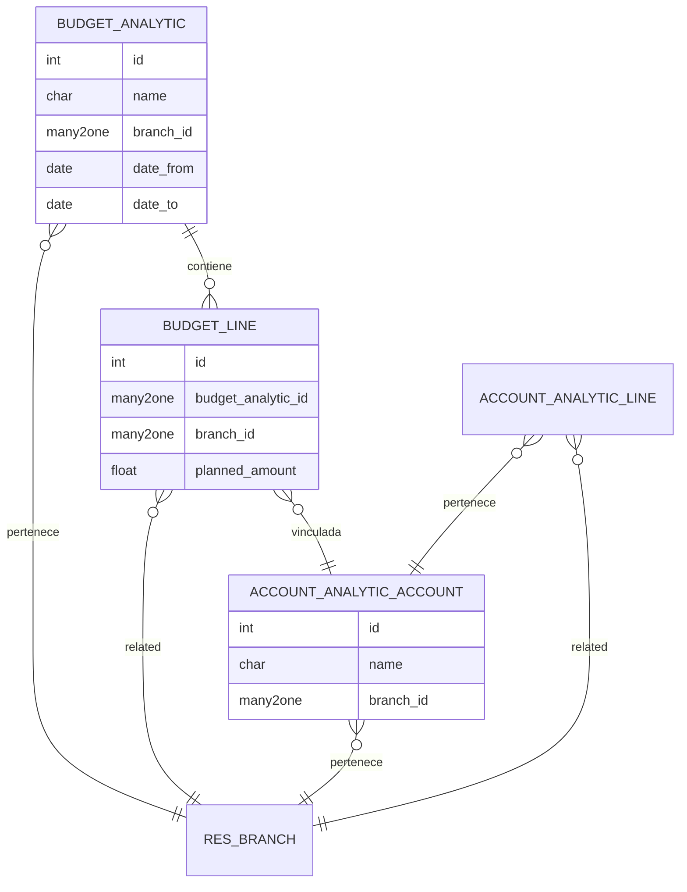
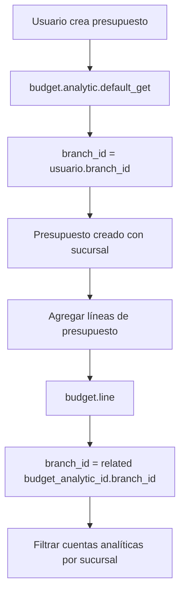
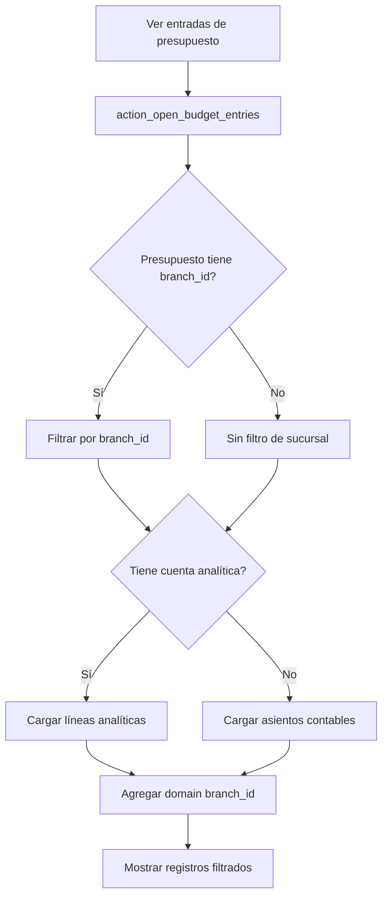
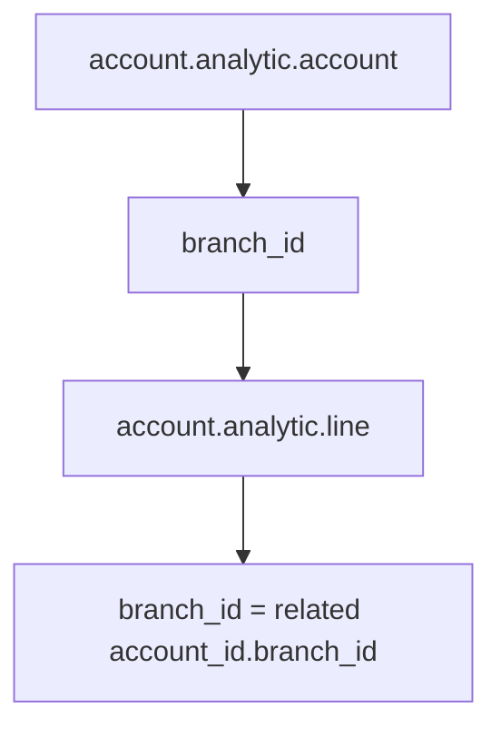

# BI Branch Budget Enterprise

> **Autor Original:** [BrowseInfo](https://www.browseinfo.in)
> **Adaptado por:** [Nimetrix](https://www.nimetrix.com/)

Módulo para gestión de presupuestos por sucursal en Odoo 18 Enterprise. Permite asignar sucursales a presupuestos analíticos, líneas de presupuesto y cuentas analíticas. Compatible con el módulo `account_budget` de Enterprise.

## Diagramas

### Arquitectura del Módulo



### Flujo de Creación de Presupuesto



### Flujo de Entradas de Presupuesto



### Herencia de Sucursal en Líneas Analíticas



## Dependencias

- `branch` - Módulo base de sucursales
- `account_budget` - Presupuestos de Odoo Enterprise

## Modelos Python

### budget.analytic (Extensión)

**Archivo:** `models/budget_analytic.py`

Extiende los presupuestos analíticos para asignar sucursal.

**Campos:**

| Campo | Tipo | Descripción |
|-------|------|-------------|
| `branch_id` | Many2one | Sucursal del presupuesto |

**Métodos:**

```python
@api.model
def default_get(self, field):
    """
    Establece la sucursal del usuario como valor por defecto.

    Returns:
        dict: Valores por defecto incluyendo branch_id
    """
    result = super(BudgetAnalytic, self).default_get(field)
    user_obj = self.env['res.users']
    branch_id = user_obj.browse(self.env.user.id).branch_id.id
    result['branch_id'] = branch_id
    return result
```

---

### budget.line (Extensión)

**Archivo:** `models/budget_line.py`

Extiende las líneas de presupuesto con sucursal heredada.

**Campos:**

| Campo | Tipo | Descripción |
|-------|------|-------------|
| `branch_id` | Many2one | Sucursal (related a budget_analytic_id.branch_id) |

```python
branch_id = fields.Many2one(
    'res.branch',
    related='budget_analytic_id.branch_id',
    string='Branch',
    store=True
)
```

**Métodos:**

```python
@api.model
def default_get(self, field):
    """
    Establece la sucursal del usuario como valor por defecto.
    """
    result = super(BudgetLine, self).default_get(field)
    user_obj = self.env['res.users']
    branch_id = user_obj.browse(self.env.user.id).branch_id.id
    result['branch_id'] = branch_id
    return result

def action_open_budget_entries(self):
    """
    Abre las entradas de presupuesto filtradas por sucursal.

    Si el presupuesto tiene branch_id:
    - Filtra líneas analíticas o asientos por sucursal
    - Agrega branch_id al domain de búsqueda

    Returns:
        dict: Action window con domain filtrado
    """
    if self.budget_analytic_id.branch_id:
        if self.analytic_account_id:
            # Cargar líneas analíticas
            action = self.env['ir.actions.act_window']._for_xml_id(
                'analytic.account_analytic_line_action_entries'
            )
            action['domain'] = [
                ('account_id', '=', self.analytic_account_id.id),
                ('date', '>=', self.date_from),
                ('date', '<=', self.date_to),
                ('branch_id', '=', self.budget_analytic_id.branch_id.id),
            ]
        else:
            # Cargar asientos contables
            action = self.env['ir.actions.act_window']._for_xml_id(
                'account.action_account_moves_all_a'
            )
            action['domain'] = [
                ('account_id', 'in', self.general_budget_id.account_ids.ids),
                ('date', '>=', self.date_from),
                ('date', '<=', self.date_to),
                ('branch_id', '=', self.budget_analytic_id.branch_id.id),
            ]
    else:
        # Sin filtro de sucursal
        # ... lógica sin branch_id ...
    return action
```

---

### account.budget.post (Extensión)

**Archivo:** `models/account_budget_post.py`

> **Nota:** Este modelo no existe en Odoo 18. El archivo se mantiene por compatibilidad pero no se usa.

**Campos:**

| Campo | Tipo | Descripción |
|-------|------|-------------|
| `branch_id` | Many2one | Sucursal de la posición presupuestaria |

---

### account.analytic.account (Extensión)

**Archivo:** `models/account_analytic_account.py`

Extiende las cuentas analíticas para asignar sucursal.

**Campos:**

| Campo | Tipo | Descripción |
|-------|------|-------------|
| `branch_id` | Many2one | Sucursal de la cuenta analítica |

**Métodos:**

```python
@api.model
def default_get(self, field):
    """
    Establece la sucursal del usuario como valor por defecto.
    """
    result = super(AccountAnalyticAccount, self).default_get(field)
    user_obj = self.env['res.users']
    branch_id = user_obj.browse(self.env.user.id).branch_id.id
    result['branch_id'] = branch_id
    return result
```

---

### account.move.line (Extensión)

**Archivo:** `models/account_analytic_account.py`

Agrega campos adicionales para integración con presupuestos.

**Campos:**

| Campo | Tipo | Descripción |
|-------|------|-------------|
| `analytic_account_id` | Many2one | Cuenta analítica |
| `product_id` | Many2one | Producto |
| `account_id` | Many2one | Cuenta contable |
| `partner_id` | Many2one | Partner |
| `date` | Date | Fecha (related a move_id.date) |

---

### account.analytic.line (Extensión)

**Archivo:** `models/account_analytic_line.py`

Hereda sucursal de la cuenta analítica.

**Campos:**

| Campo | Tipo | Descripción |
|-------|------|-------------|
| `branch_id` | Many2one | Sucursal (related a account_id.branch_id) |

```python
branch_id = fields.Many2one(
    'res.branch',
    related='account_id.branch_id',
    string='Branch'
)
```

## Vistas XML

### budget_view.xml

**Vistas extendidas:**

| Vista | Modelo | Descripción |
|-------|--------|-------------|
| `budget_analytic_inherit_bi_branch_budget_ent` | budget.analytic | Campo branch_id en formulario |
| `budget_analytic_view_tree_inherit_bi_branch_budget_ent` | budget.analytic | Campo branch_id en árbol |

**Formulario de Presupuesto:**
```xml
<record id="budget_analytic_inherit_bi_branch_budget_ent" model="ir.ui.view">
    <field name="inherit_id" ref="account_budget.view_budget_analytic_form" />
    <field name="arch" type="xml">
        <field name="user_id" position="after">
            <field name="branch_id" readonly="state != 'draft'"/>
        </field>
        <!-- En líneas de presupuesto -->
        <xpath expr="//field[@name='budget_line_ids']/list/field[@name='currency_id']" position="after">
            <field name="branch_id"/>
            <field name="auto_account_id" domain="[('branch_id', '=', parent.branch_id)]"/>
        </xpath>
    </field>
</record>
```

### budget_line_views.xml

**Vistas extendidas:**

| Vista | Modelo | Descripción |
|-------|--------|-------------|
| `view_budget_line_form_inherit_bi_branch_budget_ent` | budget.line | Campo branch_id en formulario |
| `view_budget_line_tree_inherit_bi_branch_budget_ent` | budget.line | Campo branch_id en árbol |

### Otras Vistas

- `account_analytic_account.xml` - Campo branch_id en cuentas analíticas
- `account_analytic_line.xml` - Campo branch_id en líneas analíticas
- `account_move.xml` - Integración con asientos contables
- `account_move_line.xml` - Integración con líneas de asiento
- `purchase_order.xml` - Integración con órdenes de compra

## Reglas de Seguridad

**Archivo:** `security/budget_ir_rule.xml`

| Regla | Modelo | Descripción |
|-------|--------|-------------|
| `budget_branch_manager_rule` | budget.analytic | Presupuestos de sucursales permitidas |
| `analytic_account_branch_manager_rule` | account.analytic.account | Cuentas analíticas de sucursales permitidas |
| `analytic_account_line_branch_manager_rule` | account.analytic.line | Líneas analíticas de sucursales permitidas |

**Dominio común:**
```python
['|', ('branch_id','in',[branch.id for branch in user.branch_ids]), ('branch_id','=',False)]
```

## Estructura de Archivos

```
bi_branch_budget_ent/
├── __init__.py
├── __manifest__.py
├── README.md
├── LICENSE
├── i18n/
│   └── es_VE.po
├── models/
│   ├── __init__.py
│   ├── budget_analytic.py          # budget.analytic
│   ├── budget_line.py              # budget.line
│   ├── account_budget_post.py      # account.budget.post (deprecated V18)
│   ├── account_analytic_account.py # account.analytic.account, account.move.line
│   └── account_analytic_line.py    # account.analytic.line
├── security/
│   └── budget_ir_rule.xml          # Reglas de registro
├── static/
│   └── description/                # Imágenes del módulo
└── views/
    ├── budget_view.xml             # Presupuestos
    ├── budget_line_views.xml       # Líneas de presupuesto
    ├── account_analytic_account.xml
    ├── account_analytic_line.xml
    ├── account_move.xml
    ├── account_move_line.xml
    └── purchase_order.xml
```

## Configuración

1. **Requisitos:** Odoo 18 **Enterprise** con módulo `account_budget` instalado

2. **Instalar el módulo** después de `branch` y `account_budget`

3. **Asignar sucursales a cuentas analíticas:**
   - Ir a **Contabilidad > Configuración > Cuentas Analíticas**
   - Asignar sucursal a cada cuenta

4. **Crear presupuestos por sucursal:**
   - Ir a **Contabilidad > Gestión > Presupuestos**
   - Crear presupuesto con sucursal asignada

## Comportamiento

### Presupuestos
- Al crear un presupuesto, se asigna automáticamente la sucursal del usuario
- El campo branch_id solo es editable en estado borrador
- Las líneas de presupuesto heredan la sucursal del presupuesto

### Cuentas Analíticas
- Cada cuenta analítica puede pertenecer a una sucursal
- Al crear líneas de presupuesto, se filtran cuentas por sucursal

### Líneas Analíticas
- Heredan automáticamente la sucursal de su cuenta analítica
- Permite análisis de costos/ingresos por sucursal

### Entradas de Presupuesto
- Al ver entradas desde una línea de presupuesto, se filtran por sucursal
- Tanto líneas analíticas como asientos contables respetan el filtro

## Notas Importantes

- Este módulo requiere **Odoo Enterprise** (módulo `account_budget`)
- El modelo `account.budget.post` no existe en Odoo 18, pero el archivo se mantiene por compatibilidad
- La vista `sale_order.xml` está comentada ya que `analytic_account_id` no existe en `sale.order` en V18

## Trazabilidad de Sucursal

```
budget.analytic (branch_id)
    └── budget.line (related a budget_analytic_id.branch_id)
            └── account.analytic.account (branch_id)
                    └── account.analytic.line (related a account_id.branch_id)
```

## Licencia

OPL-1 (Odoo Proprietary License)
