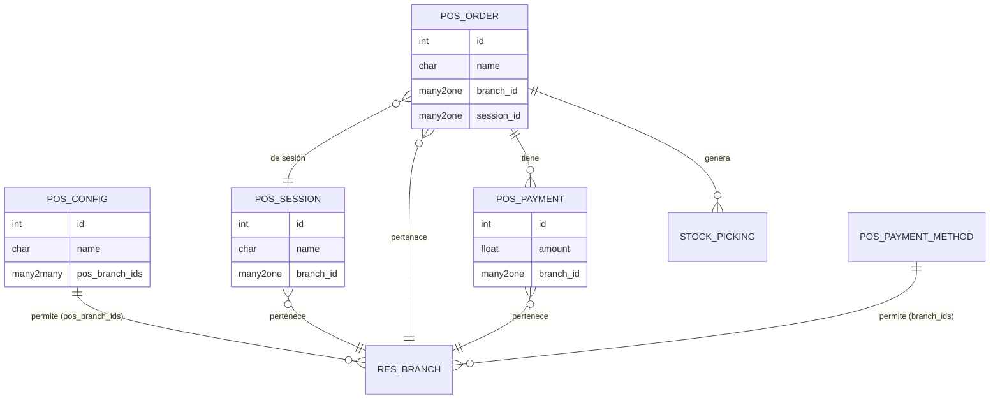
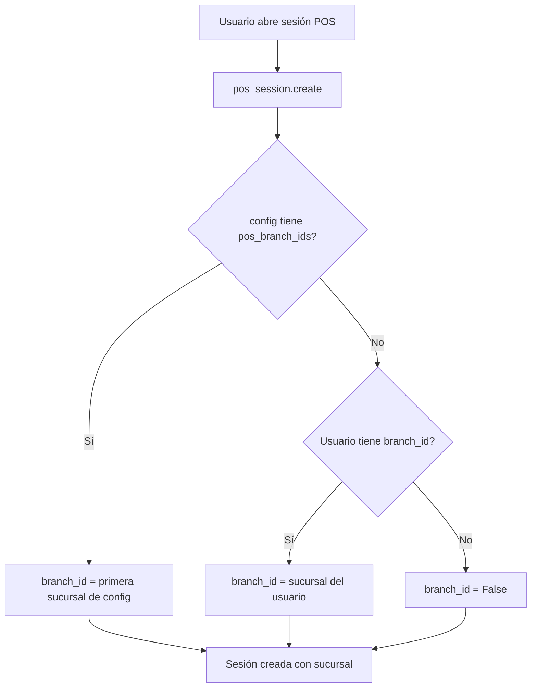
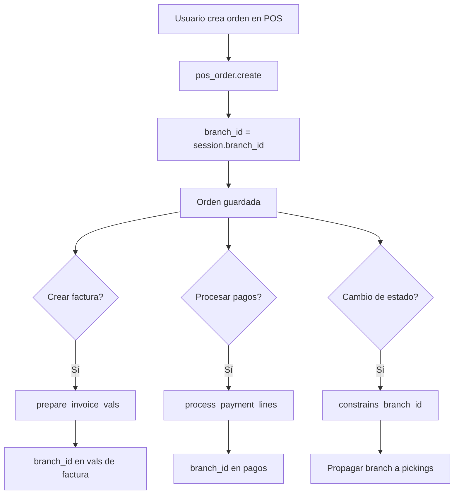
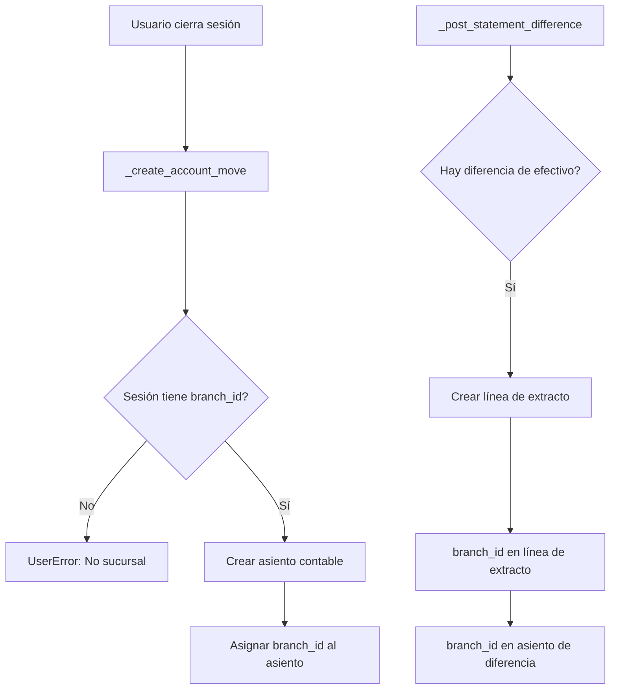
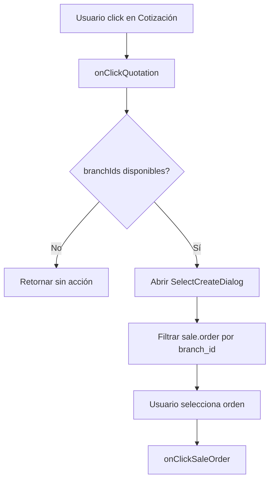

# BI Branch POS

> **Autor Original:** [BrowseInfo](https://www.browseinfo.in)
> **Adaptado por:** [Nimetrix](https://www.nimetrix.com/)

Módulo para gestión de múltiples sucursales en el Punto de Venta (POS) de Odoo 18. Permite asignar sucursales a sesiones POS, órdenes, pagos y configuraciones.

## Diagramas

### Arquitectura del Módulo



### Flujo de Creación de Sesión POS



### Flujo de Orden POS con Sucursal



### Flujo de Cierre de Sesión



### Flujo JavaScript - Selección de Cotización



## Dependencias

- `base` - Base de Odoo
- `nx_pos_dual_currency` - Doble moneda en POS
- `branch` - Módulo base de sucursales

## Modelos Python

### pos.session (Extensión)

**Archivo:** `models/pos_branch.py`

Extiende las sesiones POS para asignar sucursal automáticamente.

**Campos:**

| Campo | Tipo | Descripción |
|-------|------|-------------|
| `branch_id` | Many2one | Sucursal de la sesión |

**Métodos:**

```python
@api.model_create_multi
def create(self, vals):
    """
    Asigna branch_id al crear la sesión.

    Prioridad:
    1. Primera sucursal de pos_branch_ids del config
    2. Sucursal del usuario actual
    3. False
    """
    res = super(pos_session, self).create(vals)
    for rec in res:
        branch_id = self.env.user.branch_id if self.env.user.branch_id else False
        if res.config_id.pos_branch_ids:
            branch_id = res.config_id.pos_branch_ids[0]
        rec.branch_id = branch_id.id if branch_id else False
    return res

def _loader_params_pos_session(self):
    """
    Incluye branch_id en los campos cargados al frontend POS.
    """
    res = super()._loader_params_pos_session()
    fields = res.get('search_params').get('fields')
    fields.extend(['branch_id'])
    return res

def _prepare_account_bank_statement_line_vals(self, session, sign, amount, reason, extras):
    """
    Agrega branch_id al crear entradas/salidas de efectivo.
    """
    res = super()._prepare_account_bank_statement_line_vals(session, sign, amount, reason, extras)
    if session.branch_id:
        res.update({'branch_id': session.branch_id.id})
    return res

def _create_account_move(self, balancing_account=False, amount_to_balance=0, bank_payment_method_diffs=None):
    """
    Asigna branch_id al asiento contable de cierre de sesión.

    Raises:
        UserError: Si la sesión no tiene sucursal configurada.
    """
    data = super()._create_account_move(...)
    if not self.branch_id:
        raise UserError('No se encontró una sucursal establecida para ésta sesión.')
    self.move_id.write({'branch_id': self.branch_id.id})
    return data

def _post_statement_difference(self, amount):
    """
    Registra diferencias de efectivo con sucursal.

    Al cerrar sesión con diferencia de caja:
    - Crea línea de extracto con branch_id
    - Asigna branch_id al asiento generado
    """
```

---

### pos.config (Extensión)

**Archivo:** `models/pos_branch.py`

Configura sucursales permitidas para cada POS.

**Campos:**

| Campo | Tipo | Descripción |
|-------|------|-------------|
| `pos_branch_ids` | Many2many | Sucursales permitidas en este POS |

**Métodos:**

```python
@api.model
def get_pos_branch_ids(self, config_ids):
    """
    Obtiene las sucursales configuradas para uso en JavaScript.

    Returns:
        list: Lista de dicts con id y name de cada sucursal
    """
    pos_configs = self.browse(config_ids)
    if pos_configs:
        return [{'id': b.id, 'name': b.name} for b in pos_configs.pos_branch_ids]
    return []
```

---

### res.config.settings (Extensión)

**Archivo:** `models/pos_branch.py`

Expone configuración de sucursales en ajustes.

**Campos:**

| Campo | Tipo | Descripción |
|-------|------|-------------|
| `pos_branch_ids` | Many2many | Sucursales permitidas (related a pos_config_id) |

---

### pos.order (Extensión)

**Archivo:** `models/pos_branch.py`

Asigna sucursal a órdenes y propaga a documentos relacionados.

**Campos:**

| Campo | Tipo | Descripción |
|-------|------|-------------|
| `branch_id` | Many2one | Sucursal de la orden |

**Métodos:**

```python
@api.model_create_multi
def create(self, vals_list):
    """
    Asigna branch_id de la sesión al crear orden.
    """
    res = super().create(vals_list)
    for rec in res:
        rec.branch_id = rec.session_id.branch_id.id if rec.session_id and rec.session_id.branch_id else False
    return res

@api.model
def _payment_fields(self, order, ui_paymentline):
    """
    Incluye branch_id en los campos de pago.
    """
    values = super()._payment_fields(order, ui_paymentline)
    values['branch_id'] = order.branch_id and order.branch_id.id or False
    return values

def _prepare_invoice_vals(self):
    """
    Incluye branch_id en valores de factura.
    """
    vals = super()._prepare_invoice_vals()
    if self.session_id and self.session_id.branch_id:
        vals.update({'branch_id': self.session_id.branch_id.id})
    return vals

def _process_payment_lines(self, pos_order, order, pos_session, draft):
    """
    OVERRIDE: Incluye branch_id en pagos de devolución.
    """
    # ... lógica original ...
    return_payment_vals = {
        'name': _('return'),
        'pos_order_id': order.id,
        'amount': -pos_order['amount_return'],
        'branch_id': order.branch_id.id if order.branch_id else False,
    }

def _prepare_invoice_line(self, order_line):
    """
    Incluye branch_id en líneas de factura.
    """
    values = super()._prepare_invoice_line(order_line)
    values['branch_id'] = self.branch_id and self.branch_id.id or False
    return values

def _prepare_procurement_group_vals(self):
    """
    Incluye branch_id en grupo de aprovisionamiento.
    """
    values = super()._prepare_procurement_group_vals()
    values['branch_id'] = self.branch_id and self.branch_id.id or False
    return values

def _prepare_procurement_values(self, group_id=False):
    """
    Incluye branch_id en valores de aprovisionamiento.
    """
    values = super()._prepare_procurement_values()
    values['branch_id'] = self.branch_id and self.branch_id.id or False
    return values

@api.constrains('state')
def constrains_branch_id(self):
    """
    Propaga branch_id a los pickings al cambiar estado.
    """
    for item in self:
        item.get_branch_id()

def get_branch_id(self):
    """
    Asigna branch_id de la orden a todos sus pickings.
    """
    for picking in self.picking_ids:
        picking.branch_id = self.branch_id.id
```

---

### pos.payment (Extensión)

**Archivo:** `models/pos_branch.py`

Asigna sucursal a pagos POS y sus asientos contables.

**Campos:**

| Campo | Tipo | Descripción |
|-------|------|-------------|
| `branch_id` | Many2one | Sucursal del pago |

**Métodos:**

```python
@api.model_create_multi
def create(self, vals_list):
    """
    Asigna branch_id de la sesión al crear pago.
    """
    res = super().create(vals_list)
    for rec in res:
        rec.branch_id = rec.session_id.branch_id.id if rec.session_id and rec.session_id.branch_id else False
    return res

def _create_payment_moves(self, is_reverse=False):
    """
    OVERRIDE: Crea asientos de pago con branch_id.

    Asigna la sucursal del pago al asiento contable generado.
    """
    # ... lógica completa ...
    payment_move = self.env['account.move'].create({
        'journal_id': journal.id,
        'date': fields.Date.context_today(order, order.date_order),
        'ref': _('Pago de la factura...'),
        'pos_payment_ids': pos_payment_ids,
        'branch_id': payment.branch_id.id,  # <-- Sucursal
    })
```

---

### pos.payment.method (Extensión)

**Archivo:** `models/pos_branch.py`

Permite filtrar métodos de pago por sucursal.

**Campos:**

| Campo | Tipo | Descripción |
|-------|------|-------------|
| `branch_ids` | Many2many | Sucursales donde está disponible el método |

---

### stock.move (Extensión)

**Archivo:** `models/stock_move.py`

Propaga sucursal a movimientos de inventario desde POS.

**Métodos:**

```python
def _get_new_picking_values(self):
    """
    Incluye branch_id de la sesión POS al crear picking.
    """
    vals = super()._get_new_picking_values()
    vals['branch_id'] = self.mapped('group_id.pos_order_id.session_id.branch_id').id
    return vals
```

---

### report.pos.order (Extensión)

**Archivo:** `reports/inherited_pos_report.py`

Agrega sucursal al reporte de órdenes POS.

**Campos:**

| Campo | Tipo | Descripción |
|-------|------|-------------|
| `branch_id` | Many2one | Sucursal para agrupación/filtrado |

**Métodos:**

```python
def _select(self):
    """
    OVERRIDE: Incluye ps.branch_id en SELECT del reporte.

    Permite agrupar y filtrar ventas por sucursal.
    """
    return """
        ...
        ps.branch_id as branch_id, -- Consultar sucursal
        ...
    """
```

## JavaScript

### control_buttons.js

**Archivo:** `static/src/overrides/components/control_buttons/control_buttons.js`

Filtra órdenes de venta por sucursal al importar cotización.

```javascript
async function getPosBranchIds(posConfigId) {
    /**
     * Obtiene IDs de sucursales configuradas en el POS.
     *
     * @param {number} posConfigId - ID de pos.config
     * @returns {Array} Lista de IDs de sucursales
     */
    const ormService = useService("orm");
    const result = await ormService.call("pos.config", "get_pos_branch_ids", [[posConfigId]]);
    return result.map((branch) => branch.id);
}

patch(ControlButtons.prototype, {
    setup() {
        // Carga sucursales al inicializar
        super.setup();
        this.branchIds = [];
        const posConfigId = this.pos.config?.id;
        if (posConfigId) {
            getPosBranchIds(posConfigId).then((branchIds) => {
                this.branchIds = branchIds;
            });
        }
    },

    onClickQuotation() {
        /**
         * OVERRIDE: Filtra sale.order por sucursal del POS.
         *
         * Abre diálogo de selección con dominio:
         * - state != cancel
         * - invoice_status != invoiced
         * - currency_id = pos currency
         * - branch_id in branchIds
         */
        this.dialog.add(SelectCreateDialog, {
            resModel: "sale.order",
            domain: [
                ["state", "!=", "cancel"],
                ["invoice_status", "!=", "invoiced"],
                ["currency_id", "=", this.pos.currency.id],
                ["branch_id", "in", this.branchIds],
            ],
            onSelected: async (resIds) => {
                if (resIds.length) {
                    await this.pos.onClickSaleOrder(resIds[0]);
                }
            },
        });
    },
});
```

---

### pos_order_line.js

**Archivo:** `static/src/app/models/pos_order_line.js`

Extiende PosOrderline para manejar branch_id.

```javascript
patch(PosOrderline.prototype, {
    setup() {
        super.setup(...arguments);
        this.branch_id = this.branch_id || null;
    },

    set_branch(branch_id) {
        /** Asigna sucursal a la línea */
        this.branch_id = branch_id;
    },

    get_branch() {
        /** Obtiene sucursal de la línea */
        return this.branch_id;
    },

    init_from_JSON(json) {
        /** Restaura branch_id al cargar desde JSON */
        super.init_from_JSON(json);
        this.branch_id = json.branch_id || null;
    },

    export_as_JSON() {
        /** Exporta branch_id al guardar */
        const json = super.export_as_JSON();
        json.branch_id = this.branch_id || null;
        return json;
    },

    export_for_printing() {
        /** Incluye branch_id para impresión */
        const json = super.export_for_printing();
        json.branch_id = this.branch_id || null;
        return json;
    },
});
```

## Plantillas XML (OWL)

### pos.xml

**Archivo:** `static/src/xml/pos.xml`

Muestra sucursal en el ticket de venta.

```xml
<t t-extend="OrderLinesReceipt" owl="1">
    <xpath expr="//div[hasclass('pos-receipt-center-align')]" t-operation="after">
        <div>Branch: <t t-esc="env.pos.pos_session.branch_id[1]" /></div>
    </xpath>
</t>
```

## Vistas XML

### pos_branch_view.xml

**Vistas extendidas:**

| Vista | Modelo | Descripción |
|-------|--------|-------------|
| `pos_branch_field_session` | pos.session | Campo branch_id en formulario |
| `view_pos_session_tree_inherit_branch` | pos.session | Campo branch_id en árbol |
| `pos_config_view_form_branch_inherit` | pos.config | Campo pos_branch_ids en configuración |
| `res_config_settings_view_form` | res.config.settings | Sección de sucursales |
| `pos_sale_order_branch_field` | pos.order | Campo branch_id en formulario |
| `pos_sale_order_branch_field_tree` | pos.order | Campo branch_id en árbol |
| `view_pos_order_filter_inherit_branch` | pos.order | Filtro/agrupación por sucursal |
| `pos_account_statement_line_extended` | pos.order | Branch en lista de pagos |
| `view_pos_payment_form_extended` | pos.payment | Campo branch_id en formulario |
| `view_pos_payment_tree_extended` | pos.payment | Campo branch_id en árbol |
| `view_pos_payment_method_form_extended` | pos.payment.method | Campo branch_ids |
| `view_pos_payment_method_tree_extended` | pos.payment.method | Campo branch_ids en árbol |

## Reglas de Seguridad

**Archivo:** `security/branch_pos_security.xml`

| Regla | Modelo | Descripción |
|-------|--------|-------------|
| `pos_payment_branch_manager_rule` | pos.payment | Pagos de sucursales permitidas |
| `pos_payment_method_branch_manager_rule` | pos.payment.method | Métodos de pago con branch_ids permitidos |
| `pos_order_branch_manager_rule` | pos.order | Órdenes de sucursales permitidas |
| `pos_session_branch_manager_rule` | pos.session | Sesiones de sucursales permitidas |
| `point_of_sale_configuration_access_manager` | pos.config | Configs con pos_branch_ids permitidos |

**Dominio común:**
```python
['|', ('branch_id','in',[branch.id for branch in user.branch_ids]), ('branch_id','=',False)]
```

## Estructura de Archivos

```
bi_branch_pos/
├── __init__.py
├── __manifest__.py
├── README.md
├── LICENSE
├── i18n/
│   └── es_VE.po
├── models/
│   ├── __init__.py
│   ├── pos_branch.py           # pos.session, pos.config, pos.order, pos.payment
│   └── stock_move.py           # stock.move
├── reports/
│   ├── __init__.py
│   └── inherited_pos_report.py # report.pos.order
├── security/
│   └── branch_pos_security.xml # Reglas de registro
├── static/
│   ├── description/            # Imágenes del módulo
│   └── src/
│       ├── app/models/
│       │   └── pos_order_line.js
│       ├── overrides/components/control_buttons/
│       │   └── control_buttons.js
│       └── xml/
│           └── pos.xml
└── views/
    └── pos_branch_view.xml
```

## Configuración

1. **Instalar el módulo** después de `branch` y `nx_pos_dual_currency`

2. **Configurar sucursales en POS:**
   - Ir a **Punto de Venta > Configuración > Punto de Venta**
   - Seleccionar POS
   - En sección "Sucursales", agregar sucursales permitidas

3. **Configurar métodos de pago por sucursal:**
   - Ir a **Punto de Venta > Configuración > Métodos de Pago**
   - Asignar sucursales permitidas a cada método

4. **Asignar usuarios a sucursales:**
   - Ir a **Configuración > Usuarios**
   - Asignar sucursales permitidas en pestaña Branch

## Comportamiento

### Apertura de Sesión
- La sesión toma automáticamente la primera sucursal configurada en pos.config
- Si no hay configuración, usa la sucursal del usuario

### Órdenes de Venta
- Cada orden hereda la sucursal de la sesión
- Los pagos heredan la sucursal de la orden
- Los pickings heredan la sucursal de la orden

### Facturas
- Las facturas generadas desde POS heredan la sucursal de la sesión

### Asientos Contables
- Los asientos de cierre de sesión tienen la sucursal de la sesión
- Los asientos de pago tienen la sucursal del pago

### Reportes
- El reporte de órdenes POS permite filtrar/agrupar por sucursal

## Licencia

OPL-1 (Odoo Proprietary License)
