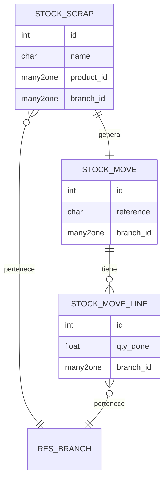
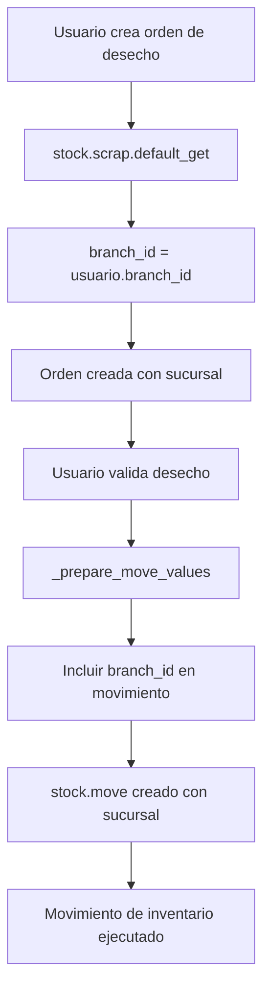
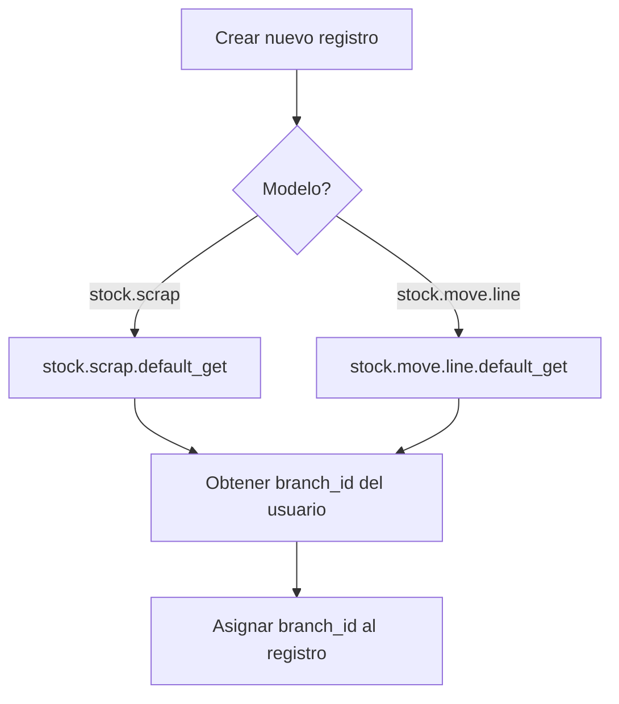

# BI Branch Scrap Order

> **Autor Original:** [BrowseInfo](https://www.browseinfo.in)
> **Adaptado por:** [Nimetrix](https://www.nimetrix.com/)

Módulo para gestión de órdenes de desecho (scrap) por sucursal en Odoo 18. Permite asignar sucursal a las órdenes de desecho y propaga la información a los movimientos de stock.

## Diagramas

### Arquitectura del Módulo



### Flujo de Orden de Desecho



### Flujo de Valores por Defecto



## Dependencias

- `sale` - Ventas
- `stock` - Inventario
- `branch` - Módulo base de sucursales

## Modelos Python

### stock.scrap (Extensión)

**Archivo:** `models/stock_scrap.py`

Extiende las órdenes de desecho para asignar sucursal.

**Campos:**

| Campo | Tipo | Descripción |
|-------|------|-------------|
| `branch_id` | Many2one | Sucursal de la orden de desecho |

**Dominio del campo:**
```python
domain=lambda self: [('id','in',[branch.id for branch in self.env.user.branch_ids])]
```

**Métodos:**

```python
@api.model
def default_get(self, field):
    """
    Establece la sucursal del usuario como valor por defecto.

    Returns:
        dict: Valores por defecto incluyendo branch_id
    """
    result = super(StockScrap, self).default_get(field)
    user_obj = self.env['res.users']
    branch_id = user_obj.browse(self.env.user.id).branch_id.id
    result['branch_id'] = branch_id
    return result

def _prepare_move_values(self):
    """
    Incluye branch_id en los valores del movimiento de stock.

    Al validar la orden de desecho, se crea un stock.move
    que hereda la sucursal de la orden.

    Returns:
        dict: Valores para crear stock.move con branch_id
    """
    res = super(StockScrap, self)._prepare_move_values()
    if self.branch_id:
        res['branch_id'] = self.branch_id.id
    return res
```

---

### stock.move.line (Extensión)

**Archivo:** `models/stock_scrap.py`

Extiende las líneas de movimiento de stock para asignar sucursal.

**Campos:**

| Campo | Tipo | Descripción |
|-------|------|-------------|
| `branch_id` | Many2one | Sucursal de la línea de movimiento |

**Métodos:**

```python
@api.model
def default_get(self, fields):
    """
    Establece la sucursal del usuario como valor por defecto.

    Returns:
        dict: Valores por defecto incluyendo branch_id
    """
    result = super(StockMoveLine, self).default_get(fields)
    user_obj = self.env['res.users']
    branch_id = user_obj.browse(self.env.user.id).branch_id.id
    result['branch_id'] = branch_id
    return result
```

## Vistas XML

### stock_scrap.xml

**Vistas extendidas:**

| Vista | Modelo | Descripción |
|-------|--------|-------------|
| `stock_scrap_form_view_inherit_bi_branch_scrap_order` | stock.scrap | Campo branch_id en formulario |
| `stock_scrap_form_view_inherit_bi_branch_scrap_order_tree` | stock.scrap | Campo branch_id en árbol (solo lectura) |

**Formulario:**
```xml
<record id="stock_scrap_form_view_inherit_bi_branch_scrap_order" model="ir.ui.view">
    <field name="inherit_id" ref="stock.stock_scrap_form_view"/>
    <field name="arch" type="xml">
        <xpath expr="//field[@name='product_id']" position="after">
            <field name="branch_id" options="{'no_quick_create': True, 'no_create_edit' : True}"/>
        </xpath>
    </field>
</record>
```

**Lista:**
```xml
<record id="stock_scrap_form_view_inherit_bi_branch_scrap_order_tree" model="ir.ui.view">
    <field name="inherit_id" ref="stock.stock_scrap_tree_view"/>
    <field name="arch" type="xml">
        <xpath expr="//field[@name='product_id']" position="after">
            <field name="branch_id" readonly="1"/>
        </xpath>
    </field>
</record>
```

## Reglas de Seguridad

**Archivo:** `security/ir_rule.xml`

| Regla | Modelo | Descripción |
|-------|--------|-------------|
| `stock_scrap_branch_manager_rule` | stock.scrap | Acceso por sucursales permitidas |

**Dominio:**
```python
['|', ('branch_id','in',[branch.id for branch in user.branch_ids]), ('branch_id','=',False)]
```

Esta regla permite:
- Ver órdenes de desecho de las sucursales asignadas al usuario
- Ver órdenes de desecho sin sucursal asignada

## Estructura de Archivos

```
bi_branch_scrap_order/
├── __init__.py
├── __manifest__.py
├── README.md
├── LICENSE
├── i18n/
│   └── es_VE.po
├── models/
│   ├── __init__.py
│   └── stock_scrap.py      # stock.scrap, stock.move.line
├── security/
│   └── ir_rule.xml         # Reglas de registro
├── static/
│   └── description/        # Imágenes del módulo
└── views/
    └── stock_scrap.xml     # Vistas de órdenes de desecho
```

## Configuración

1. **Instalar el módulo** después de `branch`

2. **Verificar asignación de sucursales:**
   - Ir a **Configuración > Usuarios**
   - Asignar sucursales permitidas en pestaña Branch

3. **Crear órdenes de desecho:**
   - Ir a **Inventario > Operaciones > Desechos**
   - El campo sucursal se llena automáticamente con la sucursal del usuario

## Comportamiento

### Creación de Orden de Desecho
- Al crear una orden de desecho, se asigna automáticamente la sucursal del usuario actual
- El usuario solo puede seleccionar sucursales a las que tiene acceso

### Validación de Desecho
- Al validar la orden, se crea un movimiento de stock (stock.move)
- El movimiento hereda la sucursal de la orden de desecho

### Filtrado de Registros
- Los usuarios solo ven órdenes de desecho de sus sucursales permitidas
- Las órdenes sin sucursal son visibles para todos

## Trazabilidad

El flujo de sucursal se mantiene a través de:

1. **stock.scrap** → Orden de desecho con sucursal
2. **stock.move** → Movimiento de inventario con sucursal (propagado)
3. **stock.move.line** → Línea de movimiento con sucursal (por defecto del usuario)

Esto permite generar reportes de desechos por sucursal y mantener trazabilidad completa de las operaciones de inventario.

## Licencia

OPL-1 (Odoo Proprietary License)
