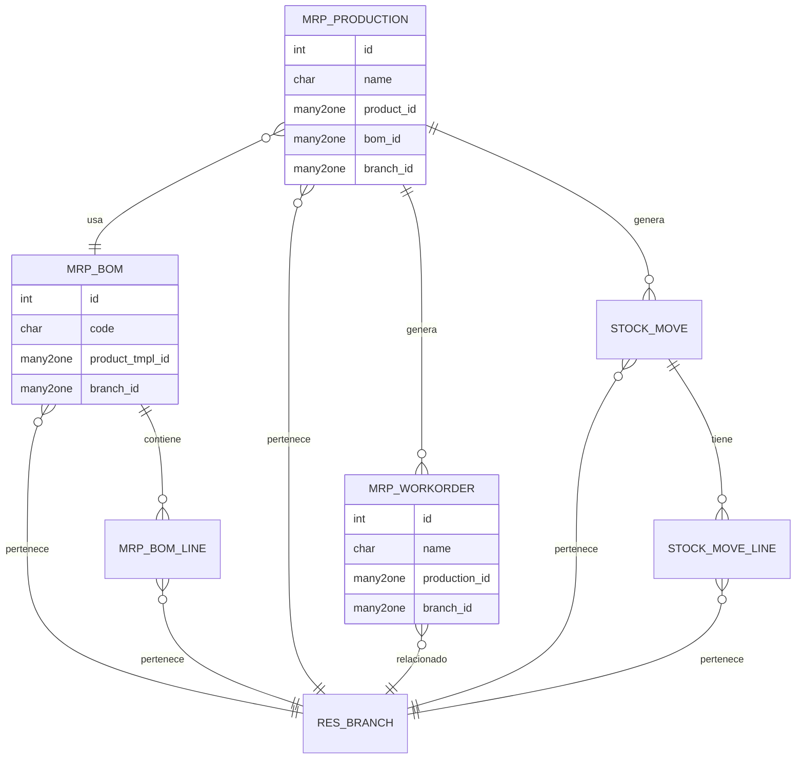
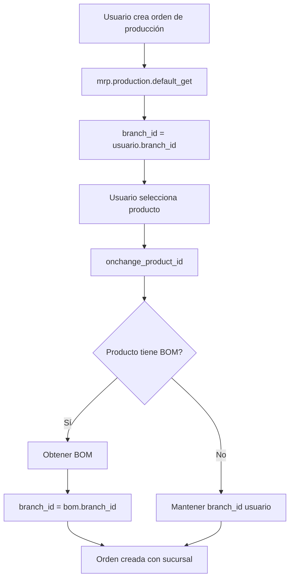
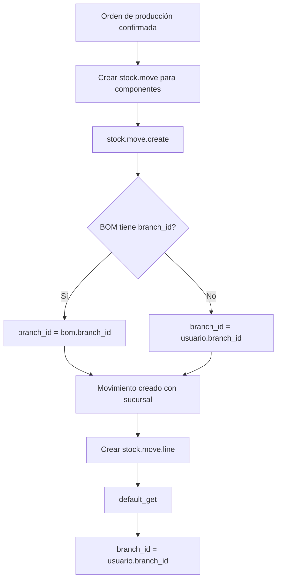
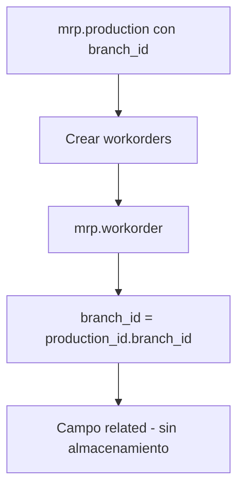

# BI Odoo MRP Multi Branch

> **Autor Original:** [BrowseInfo](https://www.browseinfo.in)
> **Adaptado por:** [Nimetrix](https://www.nimetrix.com/)

Módulo para gestión de múltiples sucursales en Manufactura (MRP) de Odoo 18. Permite asignar sucursales a listas de materiales (BOM), órdenes de producción, órdenes de trabajo y movimientos de stock relacionados.

## Diagramas

### Arquitectura del Módulo



### Flujo de Creación de Orden de Producción



### Flujo de Propagación de Sucursal en Stock



### Herencia de Sucursal en Workorder



## Dependencias

- `base` - Base de Odoo
- `branch` - Módulo base de sucursales
- `mrp` - Manufactura

## Modelos Python

### mrp.bom (Extensión)

**Archivo:** `models/mrp_branch.py`

Extiende las listas de materiales para asignar sucursal.

**Campos:**

| Campo | Tipo | Descripción |
|-------|------|-------------|
| `branch_id` | Many2one | Sucursal de la lista de materiales |

**Métodos:**

```python
@api.model
def default_get(self, flds):
    """
    Establece la sucursal del usuario como valor por defecto.

    Returns:
        dict: Valores por defecto incluyendo branch_id
    """
    result = super(MrpBom, self).default_get(flds)
    user_obj = self.env['res.users']
    branch_id = user_obj.browse(self.env.user.id).branch_id.id
    result['branch_id'] = branch_id
    return result
```

---

### mrp.bom.line (Extensión)

**Archivo:** `models/mrp_branch.py`

Extiende las líneas de BOM para asignar sucursal.

**Campos:**

| Campo | Tipo | Descripción |
|-------|------|-------------|
| `branch_id` | Many2one | Sucursal de la línea de BOM |

**Métodos:**

```python
@api.model
def default_get(self, flds):
    """
    Establece la sucursal del usuario como valor por defecto.
    """
    result = super(MrpBomLine, self).default_get(flds)
    user_obj = self.env['res.users']
    branch_id = user_obj.browse(self.env.user.id).branch_id.id
    result['branch_id'] = branch_id
    return result
```

---

### mrp.production (Extensión)

**Archivo:** `models/mrp_branch.py`

Extiende las órdenes de producción para asignar sucursal.

**Campos:**

| Campo | Tipo | Descripción |
|-------|------|-------------|
| `branch_id` | Many2one | Sucursal de la orden de producción |
| `product_id` | Many2one | Producto a fabricar |

**Métodos:**

```python
@api.model
def default_get(self, flds):
    """
    Establece la sucursal del usuario como valor por defecto.
    """
    result = super(MrpProduction, self).default_get(flds)
    user_obj = self.env['res.users']
    branch_id = user_obj.browse(self.env.user.id).branch_id.id
    result['branch_id'] = branch_id
    return result

@api.onchange('picking_type_id', 'company_id')
def onchange_product_id(self):
    """
    Busca la BOM del producto y asigna su sucursal.

    Al cambiar el producto, busca la BOM correspondiente
    y hereda la sucursal de la BOM si existe.
    """
    if not self.product_id:
        self.bom_id = False
    else:
        bom = self.env['mrp.bom']._bom_find(
            self.product_id,
            picking_type=self.picking_type_id,
            company_id=self.company_id.id,
            bom_type='normal'
        )[self.product_id]
        if bom:
            self.bom_id = bom.id
            self.branch_id = bom.branch_id.id  # Hereda sucursal de BOM
        else:
            self.bom_id = False
        self.product_uom_id = self.product_id.uom_id.id
        return {'domain': {'product_uom_id': [('category_id', '=', self.product_id.uom_id.category_id.id)]}}
```

---

### stock.move (Extensión)

**Archivo:** `models/mrp_branch.py`

Extiende los movimientos de stock para asignar sucursal desde producción.

**Campos:**

| Campo | Tipo | Descripción |
|-------|------|-------------|
| `branch_id` | Many2one | Sucursal del movimiento |

**Métodos:**

```python
@api.model_create_multi
def create(self, vals):
    """
    Asigna sucursal al crear movimientos de producción.

    Prioridad:
    1. Sucursal de la BOM de la producción
    2. Sucursal del usuario actual
    """
    res = super(StockMove, self).create(vals)
    for line in res:
        user_obj = self.env['res.users']
        branch_id = user_obj.browse(line.env.user.id).branch_id.id
        if line.raw_material_production_id.bom_id.branch_id:
            branch_id = line.raw_material_production_id.bom_id.branch_id.id
        line.branch_id = branch_id
    return res

@api.model
def default_get(self, flds):
    """
    Establece sucursal por defecto.

    Usa la sucursal de la BOM si está disponible,
    de lo contrario usa la sucursal del usuario.
    """
    result = super(StockMove, self).default_get(flds)
    user_obj = self.env['res.users']
    branch_id = user_obj.browse(self.env.user.id).branch_id.id
    if self.raw_material_production_id.bom_id.branch_id:
        branch_id = self.raw_material_production_id.bom_id.branch_id.id
    result['branch_id'] = branch_id
    return result
```

---

### mrp.workorder (Extensión)

**Archivo:** `models/mrp_branch.py`

Extiende las órdenes de trabajo para mostrar sucursal de producción.

**Campos:**

| Campo | Tipo | Descripción |
|-------|------|-------------|
| `branch_id` | Many2one | Sucursal (related a production_id.branch_id) |

```python
branch_id = fields.Many2one(
    'res.branch',
    string='Branch',
    related="production_id.branch_id"
)
```

**Métodos:**

```python
@api.model
def default_get(self, flds):
    """
    Establece la sucursal del usuario como valor por defecto.
    """
    result = super(MrpWorkorder, self).default_get(flds)
    user_obj = self.env['res.users']
    branch_id = user_obj.browse(self.env.user.id).branch_id.id
    result['branch_id'] = branch_id
    return result
```

---

### stock.move.line (Extensión)

**Archivo:** `models/mrp_branch.py`

Extiende las líneas de movimiento de stock para asignar sucursal.

**Campos:**

| Campo | Tipo | Descripción |
|-------|------|-------------|
| `branch_id` | Many2one | Sucursal de la línea de movimiento |

**Métodos:**

```python
@api.model
def default_get(self, flds):
    """
    Establece la sucursal del usuario como valor por defecto.
    """
    result = super(StockMoveLine, self).default_get(flds)
    user_obj = self.env['res.users']
    branch_id = user_obj.browse(self.env.user.id).branch_id.id
    result['branch_id'] = branch_id
    return result
```

## Vistas XML

### mrp_branch_view.xml

**Vistas extendidas:**

| Vista | Modelo | Descripción |
|-------|--------|-------------|
| `view_mrp_bom_form` | mrp.bom | Campo branch_id en formulario y líneas |
| `view_mrp_production_form` | mrp.production | Campo branch_id y en move_raw_ids |
| `view_mrp_production_tree` | mrp.production | Campo branch_id en árbol |
| `mrp_view_stock_production_workorder_inherit` | mrp.workorder | Campo branch_id en lista |
| `view_mrp_workorder_form` | mrp.workorder | Campo branch_id en formulario |

**Formulario BOM:**
```xml
<record id="view_mrp_bom_form" model="ir.ui.view">
    <field name="inherit_id" ref="mrp.mrp_bom_form_view" />
    <field name="arch" type="xml">
        <field name="company_id" position="after">
            <field name="branch_id" options="{'no_quick_create': True, 'no_create_edit' : True}"/>
        </field>
        <!-- También en líneas de BOM -->
        <xpath expr="//notebook/page/field[@name='bom_line_ids']/list/field[@name='product_id']" position="after">
            <field name="branch_id"/>
        </xpath>
    </field>
</record>
```

### manufacturing_report_view.xml

**Reportes extendidos:**

```xml
<template id="inherit_report_mrporder" inherit_id="mrp.report_mrporder">
    <xpath expr="//div[@class='row mt32 mb32']" position="after">
        <h3>Branch: <span t-esc="o.branch_id.name"/></h3>
    </xpath>
</template>
```

Muestra el nombre de la sucursal en el reporte impreso de órdenes de producción.

## Reglas de Seguridad

**Archivo:** `security/mrp_branch_security.xml`

| Regla | Modelo | Descripción |
|-------|--------|-------------|
| `mrp_bom_branch_manager_rule` | mrp.bom | BOMs de sucursales permitidas |
| `mrp_bom_line_branch_manager_rule` | mrp.bom.line | Líneas de BOM de sucursales permitidas |
| `mrp_production_branch_manager_rule` | mrp.production | Producciones de sucursales permitidas |
| `stock_move_branch_manager_rule` | stock.move | Movimientos de sucursales permitidas |
| `mrp_workorder_branch_manager_rule` | mrp.workorder | Workorders de sucursales permitidas |
| `stock_move_line_branch_manager_rule` | stock.move.line | Líneas de movimiento de sucursales permitidas |

**Dominio común:**
```python
['|',('branch_id','in',[branch.id for branch in user.branch_ids]), ('branch_id','=',False)]
```

## Estructura de Archivos

```
bi_odoo_mrp_multi_branch/
├── __init__.py
├── __manifest__.py
├── README.md
├── models/
│   ├── __init__.py
│   └── mrp_branch.py           # Todos los modelos MRP
├── report/
│   └── manufacturing_report_view.xml  # Reporte de producción
├── security/
│   └── mrp_branch_security.xml # Reglas de registro
├── static/
│   └── description/            # Imágenes del módulo
└── views/
    └── mrp_branch_view.xml     # Vistas de manufactura
```

## Configuración

1. **Instalar el módulo** después de `branch` y `mrp`

2. **Configurar sucursales en BOMs:**
   - Ir a **Fabricación > Productos > Listas de materiales**
   - Asignar sucursal a cada BOM

3. **Crear órdenes de producción:**
   - Ir a **Fabricación > Operaciones > Órdenes de producción**
   - La sucursal se hereda automáticamente de la BOM

## Comportamiento

### Listas de Materiales (BOM)
- Al crear una BOM, se asigna la sucursal del usuario
- Las líneas de BOM también tienen campo de sucursal

### Órdenes de Producción
- Al crear, se asigna sucursal del usuario
- Al seleccionar producto, se hereda sucursal de la BOM
- La sucursal se propaga a los movimientos de stock

### Movimientos de Stock
- Los movimientos de materias primas heredan sucursal de la BOM
- Si no hay BOM, usan la sucursal del usuario

### Órdenes de Trabajo
- Heredan la sucursal de la orden de producción (campo related)

### Reportes
- El reporte de orden de producción muestra el nombre de la sucursal

## Trazabilidad de Sucursal

```
mrp.bom (branch_id)
    └── mrp.production (hereda de BOM o usuario)
            ├── mrp.workorder (related a production)
            └── stock.move (hereda de BOM o usuario)
                    └── stock.move.line (usuario)
```

## Licencia

OPL-1 (Odoo Proprietary License)
