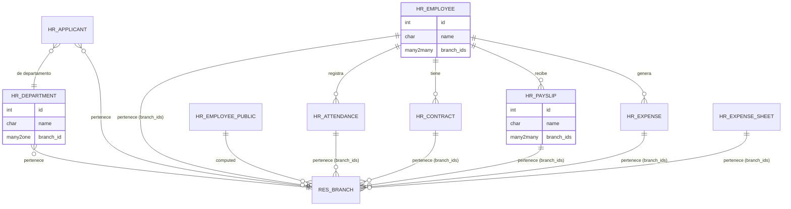
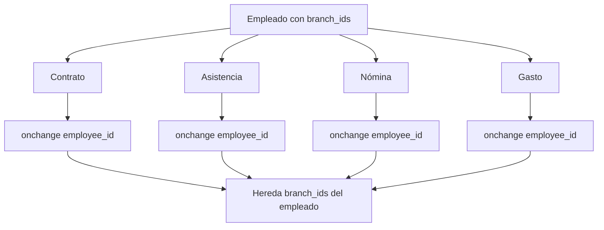
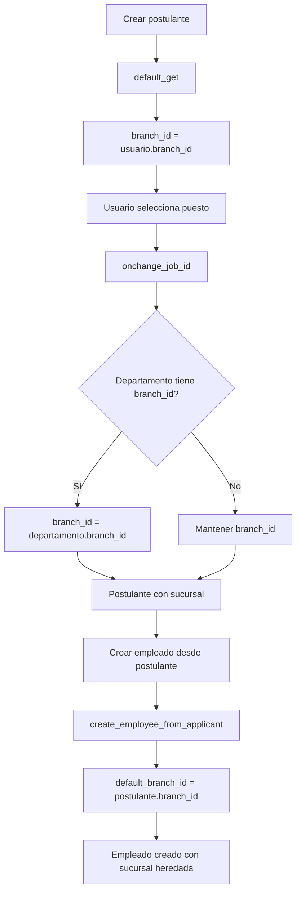
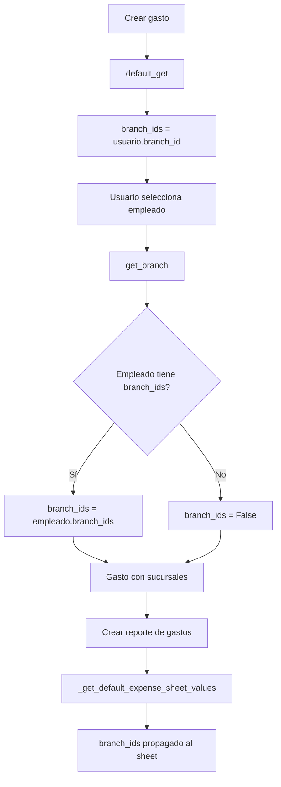

# BI Odoo Multi Branch HR

> **Autor Original:** [BrowseInfo](https://www.browseinfo.in)
> **Adaptado por:** [Nimetrix](https://www.nimetrix.com/)

Módulo para gestión de múltiples sucursales en Recursos Humanos (HR) de Odoo 18. Permite asignar sucursales a departamentos, empleados, asistencias, contratos, nóminas y gastos.

## Diagramas

### Arquitectura del Módulo



### Flujo de Herencia de Sucursal



### Flujo de Reclutamiento



### Flujo de Gastos



## Dependencias

- `base` - Base de Odoo
- `branch` - Módulo base de sucursales
- `hr_attendance` - Asistencias
- `hr_recruitment` - Reclutamiento
- `hr_contract` - Contratos
- `hr_expense` - Gastos
- `hr_payroll` - Nóminas

## Modelos Python

### hr.department (Extensión)

**Archivo:** `models/hr_branch.py`

Extiende los departamentos para asignar sucursal.

**Campos:**

| Campo | Tipo | Descripción |
|-------|------|-------------|
| `branch_id` | Many2one | Sucursal del departamento |

**Métodos:**

```python
@api.model
def default_get(self, default_fields):
    """
    Establece la sucursal del usuario como valor por defecto.
    """
    res = super(HrDepartment, self).default_get(default_fields)
    if self.env.user.branch_id:
        res.update({
            'branch_id': self.env.user.branch_id.id or False
        })
    return res
```

---

### hr.applicant (Extensión)

**Archivo:** `models/hr_branch.py`

Extiende los postulantes para asignar sucursal.

**Campos:**

| Campo | Tipo | Descripción |
|-------|------|-------------|
| `branch_id` | Many2one | Sucursal del postulante |

**Métodos:**

```python
@api.model
def default_get(self, default_fields):
    """
    Establece la sucursal del usuario como valor por defecto.
    """
    res = super(HrApplicant, self).default_get(default_fields)
    if self.env.user.branch_id:
        res.update({
            'branch_id': self.env.user.branch_id.id or False
        })
    return res

@api.onchange('job_id')
def onchange_job_id(self):
    """
    Hereda la sucursal del departamento asociado al puesto.
    """
    for rec in self:
        if rec.department_id and rec.department.branch_id:
            department = self.env['hr.department'].browse(rec.department_id.id)
            rec.branch_id = department.branch_id

def create_employee_from_applicant(self):
    """
    Crea empleado desde postulante propagando la sucursal.

    Agrega default_branch_id al contexto para que el
    empleado creado herede la sucursal del postulante.
    """
    dict_act_window = super(HrApplicant, self).create_employee_from_applicant()
    if dict_act_window.get('context'):
        dict_act_window.get('context').update({
            'default_branch_id': self.branch_id.id or False,
        })
    return dict_act_window
```

---

### hr.employee (Extensión)

**Archivo:** `models/hr_branch.py`

Extiende los empleados para asignar múltiples sucursales.

**Campos:**

| Campo | Tipo | Descripción |
|-------|------|-------------|
| `branch_ids` | Many2many | Sucursales del empleado |

**Métodos:**

```python
@api.model
def default_get(self, default_fields):
    """
    Establece la sucursal del usuario como valor por defecto.

    Usa Many2many con comando (6, 0, ids) para asignar sucursales.
    """
    res = super(HrEmployee, self).default_get(default_fields)
    if self.env.user.branch_id:
        res.update({
            'branch_ids': [(6, 0, self.env.user.branch_id.ids)] if self.env.user.branch_id else False
        })
    return res
```

---

### hr.employee.public (Extensión)

**Archivo:** `models/hr_branch.py`

Expone sucursales en la vista pública de empleados (computed).

**Campos:**

| Campo | Tipo | Descripción |
|-------|------|-------------|
| `branch_ids` | Many2many | Sucursales (computed desde employee_id) |

**Métodos:**

```python
@api.depends('employee_id', 'employee_id.branch_ids')
def _compute_branches(self):
    """
    Calcula las sucursales desde el empleado real.
    """
    for rec in self:
        rec.branch_ids = [(6, 0, rec.employee_id.branch_ids.ids)] if rec.employee_id and rec.employee_id.branch_ids else False
```

---

### hr.attendance (Extensión)

**Archivo:** `models/hr_branch.py`

Extiende las asistencias para asignar sucursales.

**Campos:**

| Campo | Tipo | Descripción |
|-------|------|-------------|
| `branch_ids` | Many2many | Sucursales de la asistencia |

**Métodos:**

```python
@api.model
def default_get(self, default_fields):
    """
    Establece la sucursal del usuario como valor por defecto.
    """
    res = super(HrAttendance, self).default_get(default_fields)
    if self.env.user.branch_id:
        res.update({
            'branch_ids': [(6, 0, self.env.user.branch_id.ids)] if self.env.user.branch_id else False
        })
    return res

@api.onchange('employee_id')
def get_branch(self):
    """
    Hereda las sucursales del empleado seleccionado.
    """
    for rec in self:
        if rec.employee_id:
            if rec.employee_id.branch_ids:
                rec.write({'branch_ids': [(6, 0, rec.employee_id.branch_ids.ids)]})
            else:
                rec.write({'branch_ids': False})
```

---

### hr.contract (Extensión)

**Archivo:** `models/hr_branch.py`

Extiende los contratos para asignar sucursales.

**Campos:**

| Campo | Tipo | Descripción |
|-------|------|-------------|
| `branch_ids` | Many2many | Sucursales del contrato |

**Métodos:**

```python
@api.onchange('employee_id')
def _onchange_employee_id(self):
    """
    Hereda las sucursales del empleado seleccionado.
    """
    for rec in self:
        if rec.employee_id:
            rec.branch_ids = [(6, 0, rec.employee_id.branch_ids.ids)]
```

---

### hr.payslip (Extensión)

**Archivo:** `models/hr_branch.py`

Extiende las nóminas para asignar sucursales.

**Campos:**

| Campo | Tipo | Descripción |
|-------|------|-------------|
| `branch_ids` | Many2many | Sucursales de la nómina |

**Métodos:**

```python
@api.model
def default_get(self, default_fields):
    """
    Establece la sucursal del usuario como valor por defecto.
    """
    res = super(HrPayslip, self).default_get(default_fields)
    if self.env.user.branch_id:
        res.update({
            'branch_ids': [(6, 0, self.env.user.branch_id.ids)] if self.env.user.branch_id else False
        })
    return res

@api.onchange('employee_id')
def get_branch(self):
    """
    Hereda las sucursales del empleado seleccionado.
    """
    for rec in self:
        if rec.employee_id:
            if rec.employee_id.branch_ids:
                rec.write({'branch_ids': [(6, 0, rec.employee_id.branch_ids.ids)]})
            else:
                rec.write({'branch_ids': False})
```

---

### hr.expense.sheet (Extensión)

**Archivo:** `models/hr_branch.py`

Extiende los reportes de gastos para asignar sucursales.

**Campos:**

| Campo | Tipo | Descripción |
|-------|------|-------------|
| `branch_ids` | Many2many | Sucursales del reporte de gastos |

**Métodos:**

```python
@api.model
def default_get(self, default_fields):
    """
    Establece la sucursal del usuario como valor por defecto.
    """
    res = super(HrExpenseSheet, self).default_get(default_fields)
    if self.env.user.branch_id:
        res.update({
            'branch_ids': [(6, 0, self.env.user.branch_id.ids)] if self.env.user.branch_id else False
        })
    return res

@api.onchange('employee_id')
def get_branch(self):
    """
    Hereda las sucursales del empleado seleccionado.
    """
    for rec in self:
        if rec.employee_id:
            if rec.employee_id.branch_ids:
                rec.write({'branch_ids': [(6, 0, rec.employee_id.branch_ids.ids)]})
            else:
                rec.write({'branch_ids': False})
```

---

### hr.expense (Extensión)

**Archivo:** `models/hr_branch.py`

Extiende los gastos individuales para asignar sucursales.

**Campos:**

| Campo | Tipo | Descripción |
|-------|------|-------------|
| `branch_ids` | Many2many | Sucursales del gasto |

**Métodos:**

```python
@api.model
def default_get(self, default_fields):
    """
    Establece la sucursal del usuario como valor por defecto.
    """
    res = super(HrExpense, self).default_get(default_fields)
    if self.env.user.branch_id:
        res.update({
            'branch_ids': [(6, 0, self.env.user.branch_id.ids)] if self.env.user.branch_id else False
        })
    return res

@api.onchange('employee_id')
def get_branch(self):
    """
    Hereda las sucursales del empleado seleccionado.
    """
    for rec in self:
        if rec.employee_id:
            if rec.employee_id.branch_ids:
                rec.write({'branch_ids': [(6, 0, rec.employee_id.branch_ids.ids)]})
            else:
                rec.write({'branch_ids': False})

def _get_default_expense_sheet_values(self):
    """
    Propaga las sucursales al crear reporte de gastos.

    Al crear un expense sheet desde gastos,
    las sucursales se incluyen en los valores.
    """
    values = super(HrExpense, self)._get_default_expense_sheet_values()
    for val_ in range(len(values)):
        values[val_].update({
            'branch_ids': self.branch_ids.ids or False,
        })
    return values
```

## Vistas XML

### hr_branch_view.xml

**Vistas extendidas:**

| Vista | Modelo | Descripción |
|-------|--------|-------------|
| `view_hr_department_form` | hr.department | Campo branch_id en formulario |
| `view_hr_department_tree` | hr.department | Campo branch_id en árbol |
| `view_hr_applicant_form` | hr.applicant | Campo branch_id en formulario |
| `view_hr_applicant_tree` | hr.applicant | Campo branch_id en árbol |
| `view_hr_employee_form` | hr.employee | Campo branch_ids en formulario |
| `view_hr_employee_public_form` | hr.employee.public | Campo branch_ids |
| `view_hr_employee_tree` | hr.employee | Campo branch_ids en árbol |
| `view_hr_attendance_form` | hr.attendance | Campo branch_ids en formulario |
| `view_hr_attendance_tree` | hr.attendance | Campo branch_ids en árbol |
| `view_hr_contract_form` | hr.contract | Campo branch_ids en formulario |
| `view_hr_contract_tree` | hr.contract | Campo branch_ids en árbol |
| `view_hr_payslip_form` | hr.payslip | Campo branch_ids en formulario |
| `view_hr_payslip_tree` | hr.payslip | Campo branch_ids en árbol |
| `view_hr_expense_sheet_form` | hr.expense.sheet | Campo branch_ids |
| `view_hr_expense_sheet_tree` | hr.expense.sheet | Campo branch_ids |
| `view_hr_expense_form` | hr.expense | Campo branch_ids en formulario |
| `view_hr_expense_tree` | hr.expense | Campo branch_ids en árbol |

### hr_payslip_details_view.xml

**Reportes extendidos:**

```xml
<template id="inherit_hr_payslip_details" inherit_id="hr_payroll.report_payslip">
    <xpath expr="//table[@class='table table-sm table-borderless'][1]" position="before">
        <h2>Branches: <span t-esc="o.branch_ids.name"/></h2>
    </xpath>
</template>
```

Muestra las sucursales en el reporte impreso de nóminas.

## Reglas de Seguridad

**Archivo:** `security/hr_branch_security.xml`

| Regla | Modelo | Descripción |
|-------|--------|-------------|
| `hr_department_branch_manager_rule` | hr.department | Departamentos de sucursales permitidas |
| `hr_applicant_branch_manager_rule` | hr.applicant | Postulantes de sucursales permitidas |
| `hr_employee_branch_manager_rule` | hr.employee | Empleados de sucursales permitidas |
| `hr_attendance_branch_manager_rule` | hr.attendance | Asistencias de sucursales permitidas |
| `hr_contract_branch_manager_rule` | hr.contract | Contratos de sucursales permitidas |
| `hr_payslip_branch_manager_rule` | hr.payslip | Nóminas de sucursales permitidas |
| `hr_expense_sheet_branch_manager_rule` | hr.expense.sheet | Reportes de gasto de sucursales permitidas |
| `hr_expense_branch_manager_rule` | hr.expense | Gastos de sucursales permitidas |

**Dominio para Many2one:**
```python
['|',('branch_id','in',[branch.id for branch in user.branch_ids]), ('branch_id','=',False)]
```

**Dominio para Many2many:**
```python
['|',('branch_ids','in',[branch.id for branch in user.branch_ids]),('branch_ids','=',False)]
```

## Estructura de Archivos

```
bi_odoo_multi_branch_hr/
├── __init__.py
├── __manifest__.py
├── README.md
├── models/
│   ├── __init__.py
│   └── hr_branch.py            # Todos los modelos HR
├── report/
│   └── hr_payslip_details_view.xml  # Reporte de nóminas
├── security/
│   └── hr_branch_security.xml  # Reglas de registro
├── static/
│   └── description/            # Imágenes del módulo
└── views/
    └── hr_branch_view.xml      # Vistas de HR
```

## Configuración

1. **Instalar el módulo** después de `branch` y los módulos de HR necesarios

2. **Asignar sucursales a departamentos:**
   - Ir a **Empleados > Configuración > Departamentos**
   - Asignar sucursal a cada departamento

3. **Asignar sucursales a empleados:**
   - Ir a **Empleados > Empleados**
   - Asignar sucursales en el formulario del empleado

## Comportamiento

### Departamentos
- Cada departamento puede pertenecer a una sucursal
- Por defecto se asigna la sucursal del usuario

### Reclutamiento
- Los postulantes heredan sucursal del departamento
- Al crear empleado, se propaga la sucursal

### Empleados
- Los empleados pueden pertenecer a múltiples sucursales (Many2many)
- La asignación se propaga a contratos, asistencias, nóminas y gastos

### Contratos
- Al seleccionar empleado, se heredan sus sucursales

### Asistencias
- Al seleccionar empleado, se heredan sus sucursales
- Por defecto se asigna la sucursal del usuario

### Nóminas
- Al seleccionar empleado, se heredan sus sucursales
- El reporte de nómina muestra las sucursales

### Gastos
- Los gastos heredan sucursales del empleado
- Se propagan al crear reporte de gastos (expense sheet)

## Trazabilidad de Sucursal

```
hr.department (branch_id)
    └── hr.applicant (hereda de departamento)
            └── hr.employee (branch_ids)
                    ├── hr.contract (hereda de empleado)
                    ├── hr.attendance (hereda de empleado)
                    ├── hr.payslip (hereda de empleado)
                    └── hr.expense (hereda de empleado)
                            └── hr.expense.sheet (hereda de expense)
```

## Licencia

OPL-1 (Odoo Proprietary License)
