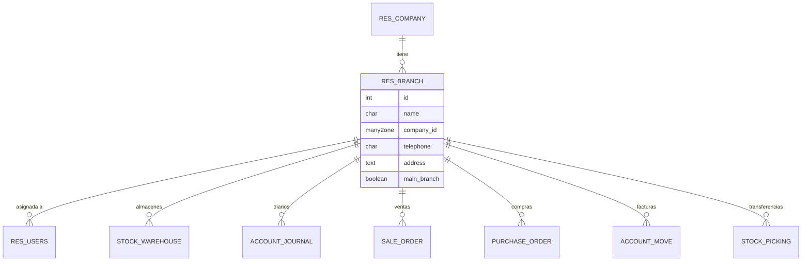
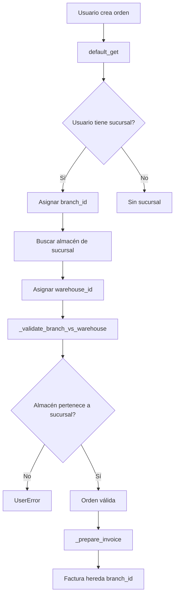
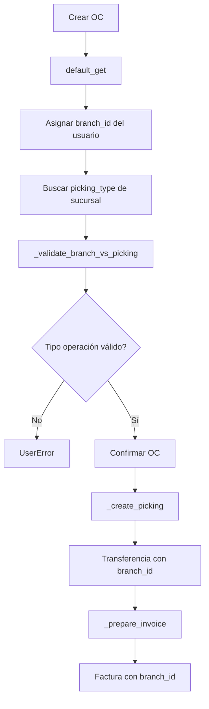
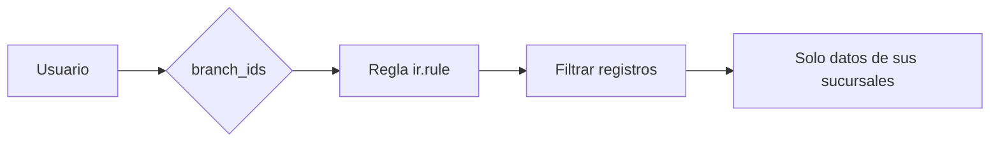

# Branch - Multi-Sucursal Base

> **Autor Original:** [BrowseInfo](https://www.browseinfo.in)
> **Adaptado por:** [Nimetrix C.A.](https://www.nimetrix.com/)

Módulo base para operación multi-sucursal en Odoo 18, permitiendo gestionar múltiples sucursales dentro de una misma compañía con segregación de datos.

## Información General

| Campo | Valor |
|-------|-------|
| **Nombre técnico** | `branch` |
| **Versión** | 18.0.0.9 |
| **Categoría** | Sales |
| **Licencia** | OPL-1 |

---

## Diagramas

### Arquitectura Multi-Sucursal



### Flujo de Orden de Venta



### Flujo de Compra



### Reglas de Acceso



---

## Dependencias

| Módulo | Descripción |
|--------|-------------|
| `base` | Base de Odoo |
| `sale_management` | Gestión de ventas |
| `purchase` | Compras |
| `stock` | Inventario |
| `account` | Contabilidad |
| `purchase_stock` | Compras con inventario |
| `web` | Framework web |
| `stock_account` | Valoración de inventario |
| `nimetrix_municipal_taxes` | Impuestos municipales (nx_localizacion) |

---

## Estructura del Módulo

```
branch/
├── models/
│   ├── branch.py                         # Modelo principal res.branch
│   ├── inherited_res_users.py            # Usuarios con sucursales
│   ├── inherited_sale_order.py           # Ventas por sucursal
│   ├── inherited_purchase_order.py       # Compras por sucursal
│   ├── inherited_account_move.py         # Facturas por sucursal
│   ├── inherited_account_payment.py      # Pagos por sucursal
│   ├── inherited_stock_warehouse.py      # Almacenes por sucursal
│   ├── inherited_stock_picking.py        # Transferencias por sucursal
│   ├── inherited_stock_move.py           # Movimientos por sucursal
│   ├── inherited_stock_location.py       # Ubicaciones por sucursal
│   ├── inherited_stock_quant.py          # Stock por sucursal
│   ├── inherited_stock_inventory.py      # Inventarios por sucursal
│   ├── inherited_customer.py             # Contactos por sucursal
│   ├── inherited_product.py              # Productos
│   ├── inherited_account_bank_statement.py
│   ├── inherited_account_bank_statement_line.py
│   ├── account_journal.py                # Diarios por sucursal
│   ├── product_pricelist.py              # Listas de precios
│   ├── stock_valuation_layer.py          # Valoración de inventario
│   └── municipal_taxes.py                # Impuestos municipales
├── views/
│   ├── res_branch_view.xml               # Vista de sucursales
│   ├── inherited_res_users.xml           # Vista de usuarios
│   ├── inherited_sale_order.xml          # Vista de ventas
│   ├── inherited_purchase_order.xml      # Vista de compras
│   ├── inherited_account_invoice.xml     # Vista de facturas
│   ├── inherited_stock_warehouse.xml     # Vista de almacenes
│   ├── inherited_stock_picking.xml       # Vista de transferencias
│   └── ... (19 archivos XML)
├── security/
│   ├── ir.model.access.csv               # Permisos de acceso
│   ├── branch_security.xml               # Grupos de seguridad
│   └── multi_branch.xml                  # Reglas de registro
├── wizard/                               # Asistentes
├── reports/                              # Reportes
├── static/                               # Assets estáticos
└── __manifest__.py
```

---

## Modelos Python

---

### `res.branch` (models/branch.py)

**Modelo nuevo:** Sucursal

Modelo principal que representa una sucursal/unidad operativa.

#### Campos

| Campo | Tipo | Atributos | Descripción |
|-------|------|-----------|-------------|
| `name` | `fields.Char` | `required=True` | Nombre de la sucursal. |
| `company_id` | `fields.Many2one` | `comodel_name='res.company'`, `required=True` | Compañía a la que pertenece. |
| `telephone` | `fields.Char` | `string='Telephone No'` | Teléfono de la sucursal. |
| `address` | `fields.Text` | `string='Address'` | Dirección de la sucursal. |
| `main_branch` | `fields.Boolean` | `string='Sucursal principal'`, `default=False` | Indica si es la sucursal principal de la compañía. |

#### Métodos

##### `_constrains_main_branch(self)`

**Decorador:** `@api.constrains('main_branch', 'company_id')`

**Descripción:** Valida que solo exista una sucursal principal por compañía.

```python
@api.constrains('main_branch', 'company_id')
def _constrains_main_branch(self):
    for branch in self:
        if branch.main_branch and self.search([
            ('main_branch', '=', True),
            ('company_id', '=', branch.company_id.id),
            ('id', '!=', branch.id)
        ], limit=1):
            raise ValidationError('Ya existe una sucursal marcada como principal para esta compañía.')
```

---

### `res.users` (models/inherited_res_users.py)

**Herencia:** `res.users`

Extensión de usuarios para asignar sucursales permitidas.

#### Campos

| Campo | Tipo | Atributos | Descripción |
|-------|------|-----------|-------------|
| `branch_ids` | `fields.Many2many` | `comodel_name='res.branch'`, `string="Allowed Branch"` | Sucursales permitidas para el usuario. |
| `branch_id` | `fields.Many2one` | `comodel_name='res.branch'`, `string='Branch'` | Sucursal activa/por defecto del usuario. |

#### Métodos

##### `_check_branch(self)`

**Decorador:** `@api.constrains('branch_id', 'branch_ids', 'active')`

**Descripción:** Valida que la sucursal activa esté en las permitidas.

```python
@api.constrains('branch_id', 'branch_ids', 'active')
def _check_branch(self):
    for user in self:
        if user.branch_id not in user.branch_ids:
            raise ValidationError(_(
                'Branch %(branch_name)s is not in the allowed branches for user %(user_name)s',
                branch_name=user.branch_id.name,
                user_name=user.name
            ))
```

---

### `sale.order` (models/inherited_sale_order.py)

**Herencia:** `sale.order`

Extensión de órdenes de venta con sucursal.

#### Campos

| Campo | Tipo | Atributos | Descripción |
|-------|------|-----------|-------------|
| `branch_id` | `fields.Many2one` | `comodel_name='res.branch'`, `domain=[usuario.branch_ids]` | Sucursal de la orden de venta. |

#### Métodos Principales

##### `default_get(self, fields)`

Asigna automáticamente la sucursal del usuario y busca el almacén correspondiente.

##### `_compute_warehouse_id(self)`

**Decorador:** `@api.depends('user_id', 'company_id', 'branch_id')`

Calcula el almacén según la sucursal seleccionada.

##### `_validate_branch_vs_warehouse(self)`

Valida que el almacén pertenezca a la sucursal de la orden.

```python
def _validate_branch_vs_warehouse(self):
    for order in self:
        if branch_id and warehouse_id and warehouse_branch:
            if branch_id.id != warehouse_branch.id:
                raise UserError(_(
                    'El almacén "%s" no pertenece a la sucursal "%s".'
                ) % (warehouse_id.display_name, branch_id.name))
```

##### `_prepare_invoice(self)`

Propaga `branch_id` a la factura generada.

---

### `purchase.order` (models/inherited_purchase_order.py)

**Herencia:** `purchase.order`

Extensión de órdenes de compra con sucursal.

#### Campos

| Campo | Tipo | Descripción |
|-------|------|-------------|
| `branch_id` | `fields.Many2one('res.branch')` | Sucursal de la orden de compra. |

#### Métodos Principales

##### `_validate_branch_vs_picking(self)`

Valida que el tipo de operación pertenezca a la sucursal.

##### `_prepare_picking(self)`

Propaga `branch_id` a las transferencias.

##### `_prepare_invoice(self)`

Propaga `branch_id` a las facturas de proveedor.

##### `_create_picking(self)`

Crea transferencias asegurando que hereden la sucursal.

---

### `account.move` (models/inherited_account_move.py)

**Herencia:** `account.move`

Extensión de asientos contables/facturas con sucursal.

#### Campos

| Campo | Tipo | Atributos | Descripción |
|-------|------|-----------|-------------|
| `branch_id` | `fields.Many2one` | `comodel_name='res.branch'`, `default=usuario.branch_id` | Sucursal del movimiento contable. |

#### Métodos Principales

##### `_search_default_journal(self)`

Busca el diario por defecto considerando la sucursal.

```python
def _search_default_journal(self):
    # Busca diario con la sucursal del movimiento
    domain = [
        ('company_id', '=', company_id),
        ('type', 'in', journal_types),
        ('branch_ids', 'in', [branch_id])
    ]
    journal = self.env['account.journal'].search(domain, limit=1)
    if not journal:
        raise UserError(_("No se pudo encontrar ningún diario..."))
    return journal
```

##### `_compute_suitable_journal_ids(self)`

**Decorador:** `@api.depends('company_id', 'invoice_filter_type_domain', 'branch_id')`

Filtra diarios disponibles por sucursal.

##### `_compute_journal_id(self)`

**Decorador:** `@api.depends('move_type', 'branch_id')`

Recalcula el diario cuando cambia la sucursal.

---

### `account.journal` (models/account_journal.py)

**Herencia:** `account.journal`

Extensión de diarios contables con múltiples sucursales.

#### Campos

| Campo | Tipo | Descripción |
|-------|------|-------------|
| `branch_ids` | `fields.Many2many('res.branch')` | Sucursales donde está disponible el diario. |

---

### `account.payment` (models/inherited_account_payment.py)

**Herencia:** `account.payment`

Extensión de pagos con sucursal.

#### Campos

| Campo | Tipo | Descripción |
|-------|------|-------------|
| `branch_id` | `fields.Many2one('res.branch')` | Sucursal del pago. |

#### Métodos

##### `_compute_available_journal_ids(self)`

**Decorador:** `@api.depends('payment_type', 'branch_id')`

Filtra diarios disponibles por sucursal.

---

### `stock.warehouse` (models/inherited_stock_warehouse.py)

**Herencia:** `stock.warehouse`

Extensión de almacenes con sucursal.

#### Campos

| Campo | Tipo | Descripción |
|-------|------|-------------|
| `branch_id` | `fields.Many2one('res.branch')` | Sucursal del almacén. |

---

### `stock.picking.type` (models/inherited_stock_warehouse.py)

**Herencia:** `stock.picking.type`

#### Campos

| Campo | Tipo | Atributos | Descripción |
|-------|------|-----------|-------------|
| `branch_id` | `fields.Many2one` | `related='warehouse_id.branch_id'`, `store=True` | Sucursal heredada del almacén. |

---

### `stock.picking` (models/inherited_stock_picking.py)

**Herencia:** `stock.picking`

Extensión de transferencias con sucursal.

#### Campos

| Campo | Tipo | Descripción |
|-------|------|-------------|
| `branch_id` | `fields.Many2one('res.branch')` | Sucursal de la transferencia. |

---

### `res.partner` (models/inherited_customer.py)

**Herencia:** `res.partner`

Extensión de contactos con múltiples sucursales.

#### Campos

| Campo | Tipo | Descripción |
|-------|------|-------------|
| `branch_ids` | `fields.Many2many('res.branch')` | Sucursales asociadas al contacto. |

---

## Seguridad

### Grupos

- Acceso completo a gestión de sucursales
- Permisos por modelo según sucursal

### Reglas de Registro (ir.rule)

Cada modelo con `branch_id` tiene reglas que filtran registros según:
- `branch_id` in `user.branch_ids` (para Many2one)
- `branch_ids` & `user.branch_ids` (para Many2many)

---

## Instalación

1. Asegurarse de tener instalado `nimetrix_municipal_taxes` (nx_localizacion)

2. Instalar el módulo desde Aplicaciones

3. Reiniciar Odoo

## Configuración

### 1. Crear Sucursales

1. Ir a **Configuración → Sucursales**
2. Crear nueva sucursal con:
   - Nombre
   - Compañía
   - Teléfono y dirección (opcional)
   - Marcar como principal si aplica

### 2. Asignar Usuarios

1. Ir a **Configuración → Usuarios**
2. En pestaña "Sucursales":
   - **Sucursales permitidas**: Todas las sucursales a las que tiene acceso
   - **Sucursal activa**: Sucursal por defecto

### 3. Configurar Almacenes

1. Ir a **Inventario → Configuración → Almacenes**
2. Asignar cada almacén a su sucursal

### 4. Configurar Diarios

1. Ir a **Contabilidad → Configuración → Diarios**
2. En cada diario, asignar las sucursales donde estará disponible

---

## Uso

### Ventas

- Al crear orden de venta, se asigna automáticamente la sucursal del usuario
- El almacén se selecciona según la sucursal
- La factura hereda la sucursal

### Compras

- Al crear orden de compra, se asigna la sucursal del usuario
- El tipo de operación se valida contra la sucursal
- Las transferencias y facturas heredan la sucursal

### Inventario

- Las transferencias se filtran por sucursal
- Los movimientos de stock heredan la sucursal
- La valoración considera la sucursal

### Contabilidad

- Los diarios se filtran por sucursal
- Las facturas muestran solo diarios de la sucursal
- Los pagos respetan la sucursal

---

## Validaciones

| Validación | Modelo | Error |
|------------|--------|-------|
| Sucursal principal única | `res.branch` | "Ya existe una sucursal marcada como principal" |
| Sucursal activa en permitidas | `res.users` | "Branch X is not in the allowed branches" |
| Almacén de sucursal | `sale.order` | "El almacén no pertenece a la sucursal" |
| Tipo operación de sucursal | `purchase.order` | "El tipo de operación no pertenece a la sucursal" |
| Diario con sucursal | `account.move` | "No se pudo encontrar ningún diario" |
