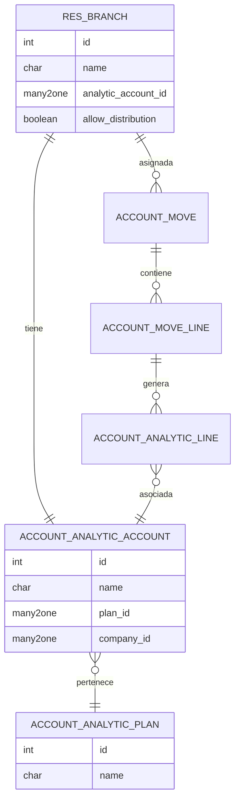
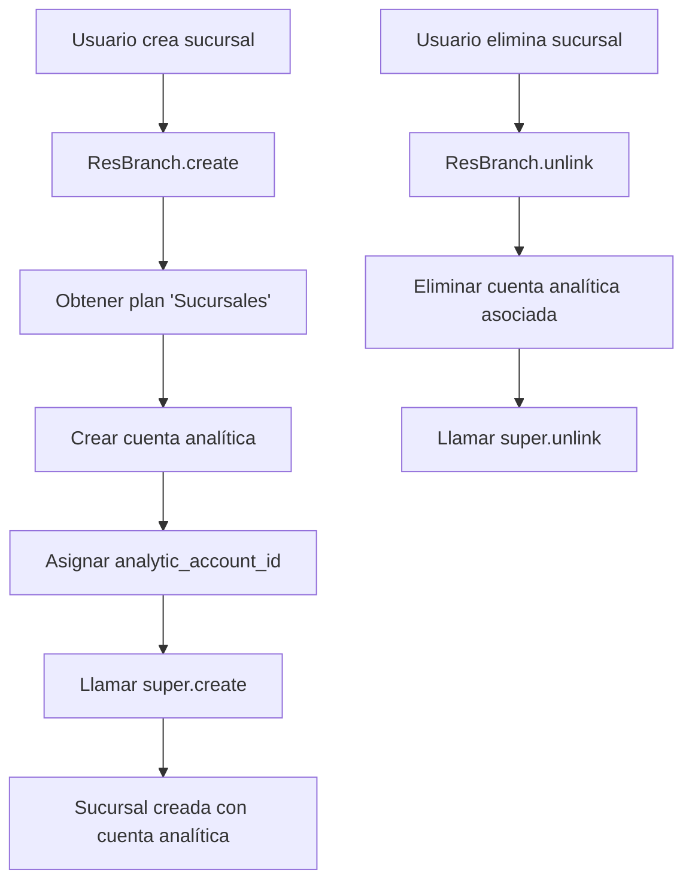
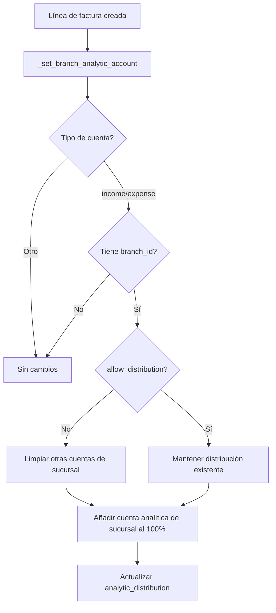
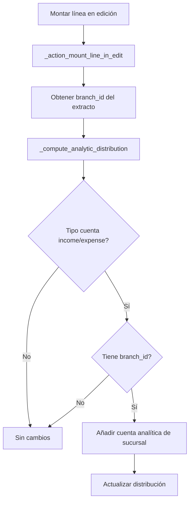

# Branch Analytic Account

> **Propiedad de [Nimetrix](https://www.nimetrix.com/)** - Todos los derechos reservados.

Módulo que integra cuentas analíticas con sucursales, creando automáticamente una cuenta analítica por cada sucursal y asignándola a los movimientos contables.

## Diagramas

### Arquitectura del Módulo



### Flujo de Creación de Sucursal



### Flujo de Asignación Analítica en Factura



### Flujo de Reconciliación Bancaria



## Dependencias

- `branch` - Módulo base de sucursales
- `nimetrix_dual_currency` - Soporte para doble moneda

## Datos Iniciales

El módulo crea el plan analítico "Sucursales" al instalarse:

```xml
<record id="branch_analytic_plan" model="account.analytic.plan">
    <field name="name">Sucursales</field>
</record>
```

## Hook Post-Instalación

El módulo ejecuta `_branch_analytic_post_init` después de la instalación para crear cuentas analíticas para sucursales existentes.

## Modelos Python

### res.branch (Extensión)

**Archivo:** `models/branch.py`

Extiende el modelo de sucursal para vincular cuentas analíticas.

**Campos:**

| Campo | Tipo | Descripción |
|-------|------|-------------|
| `analytic_account_id` | Many2one | Cuenta analítica de la sucursal (solo lectura) |
| `allow_distribution` | Boolean | Permite distribución analítica múltiple |

**Métodos:**

```python
@api.model_create_multi
def create(self, vals_list):
    """
    Crea automáticamente una cuenta analítica al crear la sucursal.

    - Obtiene el plan 'Sucursales' (branch_analytic_plan)
    - Crea cuenta analítica con el nombre de la sucursal
    - Asigna la cuenta al campo analytic_account_id
    """
    plan_id = self.env.ref('branch_analytic_account.branch_analytic_plan')
    for vals in vals_list:
        analytic_account_id = self.env['account.analytic.account'].create({
            'name': vals['name'],
            'plan_id': plan_id.id,
            'company_id': vals['company_id'],
        })
        vals['analytic_account_id'] = analytic_account_id.id
    return super(ResBranch, self).create(vals_list)

def unlink(self):
    """
    Elimina la cuenta analítica asociada al eliminar la sucursal.
    """
    self.mapped('analytic_account_id').unlink()
    return super(ResBranch, self).unlink()
```

---

### account.move.line (Extensión)

**Archivo:** `models/account_move_line.py`

Asigna automáticamente la cuenta analítica de la sucursal a las líneas de factura.

**Métodos:**

```python
def _set_branch_analytic_account(self):
    """
    Asigna la cuenta analítica de la sucursal a líneas de ingreso/gasto.

    Lógica:
    1. Solo aplica a cuentas: income, income_other, expense,
       expense_depreciation, expense_direct_cost
    2. Si allow_distribution=False: limpia otras cuentas de sucursal
    3. Añade la cuenta de la sucursal al 100%
    """
    branch_analytic_ids = self.env['res.branch'].search([]).mapped('analytic_account_id').ids
    for line in self:
        if line.account_type not in ('income', 'income_other', 'expense',
                                      'expense_depreciation', 'expense_direct_cost'):
            continue
        analytic_distribution = line.analytic_distribution or {}
        if line.branch_id:
            if not line.branch_id.allow_distribution:
                # Eliminar otras cuentas de sucursal
                analytic_distribution = {k: v for k, v in analytic_distribution.items()
                                         if int(k) not in branch_analytic_ids}
            analytic_distribution.update({str(line.branch_id.analytic_account_id.id): 100.0})
        line.analytic_distribution = analytic_distribution

@api.model_create_multi
def create(self, vals_list):
    """
    Llama _set_branch_analytic_account después de crear líneas.
    """
    lines = super(AccountMoveLine, self).create(vals_list)
    lines._set_branch_analytic_account()
    return lines

@api.onchange('analytic_distribution')
def _inverse_analytic_distribution(self):
    """
    Reaplica la cuenta de sucursal al cambiar distribución manualmente.
    """
    self.with_context(from_onchange=True)._set_branch_analytic_account()
    super(AccountMoveLine, self)._inverse_analytic_distribution()

def _prepare_analytic_distribution_line(self, distribution, account_id, distribution_on_each_plan):
    """
    Calcula el monto en moneda de referencia para líneas analíticas.

    Usa nx_debit_ref y nx_credit_ref para calcular nx_amount_ref
    considerando la distribución porcentual.
    """
    res = super()._prepare_analytic_distribution_line(distribution, account_id, distribution_on_each_plan)
    account = self.env['account.analytic.account'].browse(int(account_id))
    distribution_plan = distribution_on_each_plan.get(account.root_plan_id, 0) + distribution
    decimal_precision = self.env['decimal.precision'].precision_get('Percentage Analytic')
    if float_compare(distribution_plan, 100, precision_digits=decimal_precision) == 0:
        amount = -(self.nx_debit_ref - self.nx_credit_ref) * (100 - distribution_on_each_plan.get(account.root_plan_id, 0)) / 100.0
    else:
        amount = -(self.nx_debit_ref - self.nx_credit_ref) * distribution / 100.0
    res['nx_amount_ref'] = amount
    return res
```

---

### account.move (Extensión)

**Archivo:** `models/account_move_line.py`

Propaga el cambio de sucursal a las líneas de factura.

**Métodos:**

```python
@api.onchange('branch_id')
def _onchange_analytic_branch_id(self):
    """
    Actualiza la distribución analítica de todas las líneas
    cuando cambia la sucursal de la factura.
    """
    self.line_ids._set_branch_analytic_account()
```

---

### account.analytic.line (Extensión)

**Archivo:** `models/analytic_line.py`

Añade soporte para montos en moneda de referencia (dual currency).

**Campos:**

| Campo | Tipo | Descripción |
|-------|------|-------------|
| `nx_amount_ref` | Monetary | Importe en moneda de referencia |
| `nx_currency_ref_id` | Many2one | Moneda de referencia (de compañía) |

```python
nx_amount_ref = fields.Monetary(
    string='Importe Ref',
    default=0.0,
    currency_field='nx_currency_ref_id'
)
nx_currency_ref_id = fields.Many2one(
    related='company_id.nx_currency_ref_id',
    string='Moneda Dual Ref.'
)
```

---

### bank.rec.widget (Extensión)

**Archivo:** `models/bank_rec_widget.py`

Integra cuentas analíticas de sucursal en la reconciliación bancaria.

**Campos:**

| Campo | Tipo | Descripción |
|-------|------|-------------|
| `branch_id` | Many2one | Sucursal del extracto bancario |

**Métodos:**

```python
def _action_mount_line_in_edit(self, line_index, field_clicked=None):
    """
    Al montar una línea para edición, obtiene la sucursal
    del extracto bancario.
    """
    super()._action_mount_line_in_edit(line_index, field_clicked=field_clicked)
    self.branch_id = self.st_line_id.branch_id

def _compute_analytic_distribution(self):
    """
    Asigna automáticamente la cuenta analítica de la sucursal
    al calcular la distribución analítica en reconciliación.

    Solo aplica a cuentas de ingreso/gasto.
    """
    super()._compute_analytic_distribution()
    for wizard in self:
        if wizard.form_account_id.account_type not in (
            'income', 'income_other', 'expense',
            'expense_depreciation', 'expense_direct_cost'
        ):
            continue
        analytic_distribution = wizard.analytic_distribution or {}
        if wizard.branch_id:
            analytic_distribution.update({
                str(wizard.branch_id.analytic_account_id.id): 100.0
            })
        wizard.analytic_distribution = analytic_distribution
        wizard._onchange_analytic_distribution()
```

## Vistas XML

### res_branch_view.xml

Extiende el formulario de sucursal para mostrar campos analíticos:

```xml
<record id="branch_res_branch_view_form" model="ir.ui.view">
    <field name="inherit_id" ref="branch.branch_res_branch_view_form"/>
    <field name="arch" type="xml">
        <field name="address" position="after">
            <field name="analytic_account_id"/>
            <field name="allow_distribution"/>
        </field>
    </field>
</record>
```

### analytic_line_views.xml

Vista de líneas analíticas con el campo de moneda de referencia.

## Estructura de Archivos

```
branch_analytic_account/
├── __init__.py
├── __manifest__.py
├── README.md
├── data/
│   └── analytic_account_data.xml     # Plan analítico 'Sucursales'
├── models/
│   ├── __init__.py
│   ├── branch.py                     # res.branch extensión
│   ├── account_move_line.py          # account.move.line y account.move
│   ├── analytic_line.py              # account.analytic.line
│   └── bank_rec_widget.py            # bank.rec.widget
└── views/
    ├── res_branch_view.xml           # Formulario sucursal
    ├── analytic_line_views.xml       # Vista líneas analíticas
    └── bank_rec_widget_views.xml     # (deshabilitado en V18)
```

## Configuración

1. **Instalar el módulo** después de `branch` y `nimetrix_dual_currency`

2. **Verificar cuentas analíticas:** Al crear sucursales, se crean automáticamente las cuentas analíticas en el plan "Sucursales"

3. **Configurar distribución:** En cada sucursal, activar "Permite distribución" si se desea mantener múltiples cuentas analíticas simultáneamente

## Comportamiento

### Creación de Sucursal
- Al crear una sucursal, se crea automáticamente una cuenta analítica con el mismo nombre
- La cuenta se asocia al plan "Sucursales"

### Eliminación de Sucursal
- Al eliminar una sucursal, se elimina también su cuenta analítica asociada

### Facturas y Asientos
- Las líneas de ingreso/gasto reciben automáticamente la cuenta analítica de la sucursal
- Si `allow_distribution=False`, se reemplazan otras cuentas de sucursal
- Si `allow_distribution=True`, se mantienen otras distribuciones analíticas

### Reconciliación Bancaria
- En el widget de reconciliación, se asigna automáticamente la cuenta analítica basada en la sucursal del extracto

## Notas Técnicas

- El modelo `bank.rec.widget` no tiene vistas personalizadas en Odoo 18 (comentado en manifest)
- Los montos en moneda de referencia se calculan usando `nx_debit_ref` y `nx_credit_ref` del módulo `nimetrix_dual_currency`

## Licencia

LGPL-3
